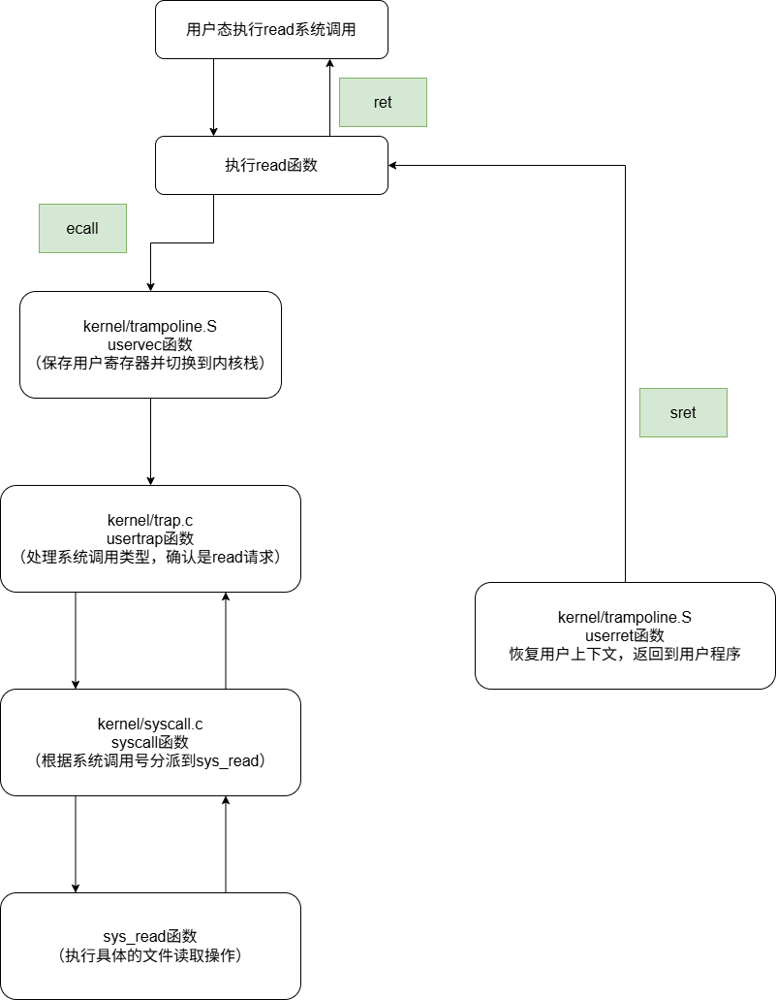

# Mit6.S081-实验2-System calls

开启实验之前，需要切换本次实验分支：

```c++
git checkout syscall
```

## 基础概念

系统调用是用户程序与内核交互的关键机制。用户程序无法直接操作硬件，也不能直接访问内核提供的资源。系统调用充当桥梁，允许用户程序通过操作系统提供的接口向内核请求服务，这样可以保持系统的稳定性和安全性。

操作系统通过CPU的特权级模式，将用户态和内核态相互隔离，保证了用户程序无法直接访问内核资源，避免了误操作和恶意行为。用户程序通过调用库函数间接发起系统调用（当然也可以直接发起系统调用），系统调用触发软件中断或者陷阱（Trap），引发CPU切换到内核态，内核根据系统调用号确定要执行的服务，完成服务之后，将结果或者错误码存入用户程序的寄存器中，并且返回到用户态继续执行程序。



添加新的系统调用涉及到的文件如下：

* user/user.h：用户态程序调用跳板函数
* user.usys.pl：跳板函数使用CPU提供的ecall指令，切换到内核态
* kernel/syscall.c：内核态下调用系统调用处理函数`syscall()`，所有系统调用都会跳到这里来处理
* kernel/syscall.h：设定系统调用号，`syscall()`根据跳板传来的系统调用号，查询`syscalls[]`表，找到对应的内核函数并调用

## 具体实验细节

### System call tracing（moderate）

这个实验要求实现trace功能，跟踪用户程序中调用的系统调用，并将调用的相关信息打印出来。目前代码中已经写好了用户态的trace（在user/trace.c中），但是实际的trace系统调用还没有实现。

从题目给出的例子来说明该实验：

```bash
$ trace 32 grep hello README
3: syscall read -> 1023
3: syscall read -> 966
3: syscall read -> 70
3: syscall read -> 0
```

`trace`表示启用跟踪功能，32表示跟踪系统调用号掩码为5的系统调用（`1 << 5 = 32`），在kernel/syscall.h中，可以看到：

```c++
// System call numbers
#define SYS_fork    1
#define SYS_exit    2
#define SYS_wait    3
#define SYS_pipe    4
#define SYS_read    5
```

这里表示要跟踪`read`系统调用，然后执行`grep hello README`命令，即用`grep`搜索`README`文件中的`hello`。

执行`trace 32 grep hello README`命令之后，需要实现的效果是：在打印输出中，3表示运行`grep`的进程ID，`syscall read`表示发生了`read`系统调用，`1024`，表示调用`read`系统调用的返回值，此处说明读取了1023B。

再看题目给出的另一个例子：

```c++
$ trace 2147483647 grep hello README
4: syscall trace -> 0
4: syscall exec -> 3
4: syscall open -> 3
4: syscall read -> 1023
4: syscall read -> 966
4: syscall read -> 70
4: syscall read -> 0
4: syscall close -> 0
```

同理，在这个例子中，`2147483647`的二进制中所有低31位都为1，表示跟踪所有系统调用。因此在输出中可以看到，执行`grep hello README`命令涉及到的所有系统调用都会被打印出来。

理解了上述的知识之后，开始修改代码实现这个实验。

在user/user.h中加入函数声明，让用户态程序可以找到这个跳板入口函数：

```c++
// system calls
int fork(void);
int exit(int) __attribute__((noreturn));
int wait(int*);
int pipe(int*);
int write(int, const void*, int);
int read(int, void*, int);
int close(int);
int kill(int);
int exec(char*, char**);
int open(const char*, int);
int mknod(const char*, short, short);
int unlink(const char*);
int fstat(int fd, struct stat*);
int link(const char*, const char*);
int mkdir(const char*);
int chdir(const char*);
int dup(int);
int getpid(void);
char* sbrk(int);
int sleep(int);
int uptime(void);
int trace(int);     // 用户态程序可以找到trace系统调用的跳板入口函数
```

在user/usys.pl中，加入用户态到内核态的跳板函数：

```c++
entry("fork");
entry("exit");
entry("wait");
entry("pipe");
entry("read");
entry("write");
entry("close");
entry("kill");
entry("exec");
entry("open");
entry("mknod");
entry("unlink");
entry("fstat");
entry("link");
entry("mkdir");
entry("chdir");
entry("dup");
entry("getpid");
entry("sbrk");
entry("sleep");
entry("uptime");
entry("trace");     # 为trace添加系统调用接口
```

该文件是一个Perl脚本，用于生成`usys.S`文件，包含用户态程序调用内核态系统调用的接口。

因为`user/trace.c`实现的是一个用户空间的函数，所以需要在Makefile中添加：

```c++
UPROGS=\
	$U/_cat\
	$U/_echo\
	$U/_forktest\
	$U/_grep\
	$U/_init\
	$U/_kill\
	$U/_ln\
	$U/_ls\
	$U/_mkdir\
	$U/_rm\
	$U/_sh\
	$U/_stressfs\
	$U/_usertests\
	$U/_grind\
	$U/_wc\
	$U/_zombie\
	$U/_trace\
```

以上是用户态的修改，接下来是内核态的修改。

在kernel/syscall.h中，添加trace的系统调用号（掩码）:

```c++
// System call numbers
#define SYS_fork    1
#define SYS_exit    2
#define SYS_wait    3
#define SYS_pipe    4
#define SYS_read    5
#define SYS_kill    6
#define SYS_exec    7
#define SYS_fstat   8
#define SYS_chdir   9
#define SYS_dup    10
#define SYS_getpid 11
#define SYS_sbrk   12
#define SYS_sleep  13
#define SYS_uptime 14
#define SYS_open   15
#define SYS_write  16
#define SYS_mknod  17
#define SYS_unlink 18
#define SYS_link   19
#define SYS_mkdir  20
#define SYS_close  21
#define SYS_trace  22       // trace系统调用号
```

在kernel/syscall.c中，全局声明trace系统调用处理函数，并且把系统调用号与处理函数关联：

```c++
extern uint64 sys_chdir(void);
extern uint64 sys_close(void);
extern uint64 sys_dup(void);
extern uint64 sys_exec(void);
extern uint64 sys_exit(void);
extern uint64 sys_fork(void);
extern uint64 sys_fstat(void);
extern uint64 sys_getpid(void);
extern uint64 sys_kill(void);
extern uint64 sys_link(void);
extern uint64 sys_mkdir(void);
extern uint64 sys_mknod(void);
extern uint64 sys_open(void);
extern uint64 sys_pipe(void);
extern uint64 sys_read(void);
extern uint64 sys_sbrk(void);
extern uint64 sys_sleep(void);
extern uint64 sys_unlink(void);
extern uint64 sys_wait(void);
extern uint64 sys_write(void);
extern uint64 sys_uptime(void);
extern uint64 sys_trace(void);    // 全局声明trace系统调用处理函数

static uint64 (*syscalls[])(void) = {
[SYS_fork]    sys_fork,
[SYS_exit]    sys_exit,
[SYS_wait]    sys_wait,
[SYS_pipe]    sys_pipe,
[SYS_read]    sys_read,
[SYS_kill]    sys_kill,
[SYS_exec]    sys_exec,
[SYS_fstat]   sys_fstat,
[SYS_chdir]   sys_chdir,
[SYS_dup]     sys_dup,
[SYS_getpid]  sys_getpid,
[SYS_sbrk]    sys_sbrk,
[SYS_sleep]   sys_sleep,
[SYS_uptime]  sys_uptime,
[SYS_open]    sys_open,
[SYS_write]   sys_write,
[SYS_mknod]   sys_mknod,
[SYS_unlink]  sys_unlink,
[SYS_link]    sys_link,
[SYS_mkdir]   sys_mkdir,
[SYS_close]   sys_close,
[SYS_trace]   sys_trace,    // 系统调用号与处理函数关联
};
```

在kernel/proc.h中，在进程类proc结构中，添加`syscall_trace`属性，用掩码的方式记录要跟踪的系统调用：

```c++
// Per-process state
struct proc {
  struct spinlock lock;

  // p->lock must be held when using these:
  enum procstate state;        // Process state
  struct proc *parent;         // Parent process
  void *chan;                  // If non-zero, sleeping on chan
  int killed;                  // If non-zero, have been killed
  int xstate;                  // Exit status to be returned to parent's wait
  int pid;                     // Process ID

  // these are private to the process, so p->lock need not be held.
  uint64 kstack;               // Virtual address of kernel stack
  uint64 sz;                   // Size of process memory (bytes)
  pagetable_t pagetable;       // User page table
  struct trapframe *trapframe; // data page for trampoline.S
  struct context context;      // swtch() here to run process
  struct file *ofile[NOFILE];  // Open files
  struct inode *cwd;           // Current directory
  char name[16];               // Process name (debugging)
  uint64 syscall_trace;        // 存储进程的系统调用跟踪掩码，用于记录哪些系统调用需要被跟踪
};
```

这里添加了新的属性，所以在跟进程类有关的地方都需要做出相应的修改。首先是进程的初始化中，对这个属性设置默认值0，在kernel/proc.c中：

```c++
static struct proc*
allocproc(void)
{
  struct proc *p;

  for(p = proc; p < &proc[NPROC]; p++) {
    acquire(&p->lock);
    if(p->state == UNUSED) {
      goto found;
    } else {
      release(&p->lock);
    }
  }
  return 0;

found:
  p->pid = allocpid();

  // Allocate a trapframe page.
  if((p->trapframe = (struct trapframe *)kalloc()) == 0){
    release(&p->lock);
    return 0;
  }

  // An empty user page table.
  p->pagetable = proc_pagetable(p);
  if(p->pagetable == 0){
    freeproc(p);
    release(&p->lock);
    return 0;
  }

  // Set up new context to start executing at forkret,
  // which returns to user space.
  memset(&p->context, 0, sizeof(p->context));
  p->context.ra = (uint64)forkret;
  p->context.sp = p->kstack + PGSIZE;

  p->syscall_trace = 0;   // syscall_trace初始化

  return p;
}
```

在kernel/proc.c中的`fork`函数中，子进程能继承父进程的这个属性：

```c++
int
fork(void)
{
  int i, pid;
  struct proc *np;
  struct proc *p = myproc();

  // Allocate process.
  if((np = allocproc()) == 0){
    return -1;
  }

  // Copy user memory from parent to child.
  if(uvmcopy(p->pagetable, np->pagetable, p->sz) < 0){
    freeproc(np);
    release(&np->lock);
    return -1;
  }
  np->sz = p->sz;

  np->parent = p;

  // copy saved user registers.
  *(np->trapframe) = *(p->trapframe);

  // Cause fork to return 0 in the child.
  np->trapframe->a0 = 0;

  // increment reference counts on open file descriptors.
  for(i = 0; i < NOFILE; i++)
    if(p->ofile[i])
      np->ofile[i] = filedup(p->ofile[i]);
  np->cwd = idup(p->cwd);

  safestrcpy(np->name, p->name, sizeof(p->name));

  pid = np->pid;

  np->state = RUNNABLE;

  np->syscall_trace = p->syscall_trace;   // 子进程继承父进程的syscall_trace

  release(&np->lock);

  return pid;
}
```

因为是在一个进程中跟踪系统调用，所以此处在kernel/sysproc.c中实现这个系统调用。这里实现的是：为进程的`syscall_trace`属性赋值，跟踪用户程序传进来需要跟踪的系统调用号：

```c++
// 当前进程的系统调用跟踪掩码
uint64 sys_trace(void){
  int mask;
  if(argint(0, &mask) < 0){	// 获取用户程序传入的数据
    return -1;
  }

  myproc()->syscall_trace = mask;	// 设置调用进程的syscall_trace掩码mask
  return 0;
}
```

因为跟踪的是系统调用，所以可以在触发系统调用的时候，按照题目要求打印数据。所有的系统调用都会在kernel/syscall.c中的`syscall()`函数中进行处理，因此在此处打印跟踪信息：

```c++
void
syscall(void)
{
  int num;    // 系统调用号
  struct proc *p = myproc();

  // 获取系统调用号
  num = p->trapframe->a7;

  // 如果系统调用编号有效
  if(num > 0 && num < NELEM(syscalls) && syscalls[num]) {
    // 调用对应的处理函数，并将其返回值存储到a0寄存器中
    p->trapframe->a0 = syscalls[num]();

    // 如果当前进程启用了trace跟踪，则打印信息
    if((p->syscall_trace >> num) & 1){
      printf("%d: syscall %s -> %d\n", p->pid, syscall_names[num], p->trapframe->a0);
    }
  } else {
    printf("%d %s: unknown sys call %d\n",
            p->pid, p->name, num);
    p->trapframe->a0 = -1;
  }
}
```

为了方便调试、日志记录或错误报告，此处还定义了一个syscall_names字符串数组映射，用来快速获取系统调用号对应的系统调用函数名：

```c++
const char* syscall_names[] = {
[SYS_fork]    "fork",
[SYS_exit]    "exit",
[SYS_wait]    "wait",
[SYS_pipe]    "pipe",
[SYS_read]    "read",
[SYS_kill]    "kill",
[SYS_exec]    "exec",
[SYS_fstat]   "fstat",
[SYS_chdir]   "chdir",
[SYS_dup]     "dup",
[SYS_getpid]  "getpid",
[SYS_sbrk]    "sbrk",
[SYS_sleep]   "sleep",
[SYS_uptime]  "uptime",
[SYS_open]    "open",
[SYS_write]   "write",
[SYS_mknod]   "mknod",
[SYS_unlink]  "unlink",
[SYS_link]    "link",
[SYS_mkdir]   "mkdir",
[SYS_close]   "close",
[SYS_trace]   "trace",    
};
```

至此，这个实验就已经完成了。

值得注意的是，后续的实验中用到添加新的系统调用的擦欧总的时候，可以以这个实验为模板，实现对应的系统调用。

### Sysinfo（moderate）

该实验需要添加一个系统调用`sysinfo`，用来获取空闲的内存、已经创建的进程数量。在`kernel/sysinfo.h`中，已经声明好了`freemem`空闲内存属性和`nproc`进程数量属性，我们需要把获取到的数据赋值给这两个属性。

在user/user.h中

```c++
// system calls
int fork(void);
int exit(int) __attribute__((noreturn));
int wait(int*);
int pipe(int*);
int write(int, const void*, int);
int read(int, void*, int);
int close(int);
int kill(int);
int exec(char*, char**);
int open(const char*, int);
int mknod(const char*, short, short);
int unlink(const char*);
int fstat(int fd, struct stat*);
int link(const char*, const char*);
int mkdir(const char*);
int chdir(const char*);
int dup(int);
int getpid(void);
char* sbrk(int);
int sleep(int);
int uptime(void);
int trace(int);     // 用户态程序可以找到trace系统调用的跳板入口函数
struct sysinfo;    // 声明sysinfo结构体，使得用户程序可以使用这个结构体
int sysinfo(struct sysinfo*); // 用户态程序可以找到sysinfo系统调用的跳板入口函数
```

在user/usys.pl中

```c++
entry("fork");
entry("exit");
entry("wait");
entry("pipe");
entry("read");
entry("write");
entry("close");
entry("kill");
entry("exec");
entry("open");
entry("mknod");
entry("unlink");
entry("fstat");
entry("link");
entry("mkdir");
entry("chdir");
entry("dup");
entry("getpid");
entry("sbrk");
entry("sleep");
entry("uptime");
entry("trace");     # 为trace添加系统调用接口
entry("sysinfo");
```

在kernel/syscall.h中，添加sysinfo系统调用号：

```c++
// System call numbers
#define SYS_fork    1
#define SYS_exit    2
#define SYS_wait    3
#define SYS_pipe    4
#define SYS_read    5
#define SYS_kill    6
#define SYS_exec    7
#define SYS_fstat   8
#define SYS_chdir   9
#define SYS_dup    10
#define SYS_getpid 11
#define SYS_sbrk   12
#define SYS_sleep  13
#define SYS_uptime 14
#define SYS_open   15
#define SYS_write  16
#define SYS_mknod  17
#define SYS_unlink 18
#define SYS_link   19
#define SYS_mkdir  20
#define SYS_close  21
#define SYS_trace  22       // trace系统调用号
#define SYS_sysinfo 23      // sysinfo系统调用号
```

在kernel/syscall.c中，添加系统调用映射

```c++
extern uint64 sys_chdir(void);
extern uint64 sys_close(void);
extern uint64 sys_dup(void);
extern uint64 sys_exec(void);
extern uint64 sys_exit(void);
extern uint64 sys_fork(void);
extern uint64 sys_fstat(void);
extern uint64 sys_getpid(void);
extern uint64 sys_kill(void);
extern uint64 sys_link(void);
extern uint64 sys_mkdir(void);
extern uint64 sys_mknod(void);
extern uint64 sys_open(void);
extern uint64 sys_pipe(void);
extern uint64 sys_read(void);
extern uint64 sys_sbrk(void);
extern uint64 sys_sleep(void);
extern uint64 sys_unlink(void);
extern uint64 sys_wait(void);
extern uint64 sys_write(void);
extern uint64 sys_uptime(void);
extern uint64 sys_trace(void);    // 全局声明trace系统调用处理函数
extern uint64 sys_sysinfo(void);  // 全局声明sysinfo系统调用处理函数

// .......

static uint64 (*syscalls[])(void) = {
[SYS_fork]    sys_fork,
[SYS_exit]    sys_exit,
[SYS_wait]    sys_wait,
[SYS_pipe]    sys_pipe,
[SYS_read]    sys_read,
[SYS_kill]    sys_kill,
[SYS_exec]    sys_exec,
[SYS_fstat]   sys_fstat,
[SYS_chdir]   sys_chdir,
[SYS_dup]     sys_dup,
[SYS_getpid]  sys_getpid,
[SYS_sbrk]    sys_sbrk,
[SYS_sleep]   sys_sleep,
[SYS_uptime]  sys_uptime,
[SYS_open]    sys_open,
[SYS_write]   sys_write,
[SYS_mknod]   sys_mknod,
[SYS_unlink]  sys_unlink,
[SYS_link]    sys_link,
[SYS_mkdir]   sys_mkdir,
[SYS_close]   sys_close,
[SYS_trace]   sys_trace,    // 系统调用号与处理函数关联
[SYS_sysinfo] sys_sysinfo,
};
```

接下来就实现sysinfo函数，在kernel/sysproc.c中实现sysinfo。

```c++
#include "sysinfo.h"	// 文件开头加上sysinfo结构体的头文件

// 收集系统信息
uint64 sys_sysinfo(void){
  struct sysinfo info;
  freebytes(&info.freemem); // 获取空闲内存
  procnum(&info.nproc);     // 获取进程数量

  // 获取用户虚拟地址
  uint64 dstadder;
  argaddr(0, &dstadder);

  // 从内核空间拷贝数据到用户空间
  if(copyout(myproc()->pagetable, dstadder, (char*)&info, sizeof info) < 0){
    return -1;
  }
  
  return 0;
}
```

在这个函数里面，我们自己调用了两个还未实现的函数`freebytes`和`procnum`，作用分别是获取空闲内存和获取进程数量。

值得注意的是，由于获取到信息后的sysinfo结构体是在内核空间中的，所以需要将其拷贝到用户空间进程的内存中。

在kernel/kalloc.c中，实现`freebytes`函数：

```c++
// 获取空闲内存
void freebytes(uint64* dst){
  *dst= 0;    // 初始化计数器为0
  struct run* p = kmem.freelist;  // 获取空闲内存链表头
  acquire(&kmem.lock);  // 加锁
  while(p){
    *dst += PGSIZE; // 每页增加PGSIZE字节
    p = p->next;    // 移动到下一个空闲页
  }
  release(&kmem.lock);  // 释放锁
}
```

在kernel/proc.c中，实现`procnum`函数：

```c++
// 统计处于活动状态的进程
void procnum(uint64* dst){
  *dst = 0;   // 初始化计数器为0
  struct proc* p; // 进程控制块指针
  for(p = proc; p < &proc[NPROC]; p++){ // 遍历所有的进程
    if(p->state != UNUSED){ // 检查进程状态是否非空
      (*dst)++; // 活动进程计数+1
    }
  }
}
```

在kernel/proc.c中，有一个进程表`struct proc proc[NPROC]`，记录了所有的进程，而每个进程有一个state属性，表示进程是否在使用。所以实现`procnum`函数的思路：遍历proc进程表，判断当前进程是否在使用，在使用则数量+1。

最后，为了使得kernel/sysproc.c中的`sys_sysinfo`可以找到这两个函数`freebytes`和`procnum`，我们还需要在内核头文件`kernel/defs.h`中声明这两个函数：

```c++
// kalloc.c
void*           kalloc(void);
void            kfree(void *);
void            kinit(void);
void            freebytes(uint64* dst);     // 获取空闲内存

// .........

// proc.c
int             cpuid(void);
void            exit(int);
int             fork(void);
int             growproc(int);
pagetable_t     proc_pagetable(struct proc *);
void            proc_freepagetable(pagetable_t, uint64);
int             kill(int);
struct cpu*     mycpu(void);
struct cpu*     getmycpu(void);
struct proc*    myproc();
void            procinit(void);
void            scheduler(void) __attribute__((noreturn));
void            sched(void);
void            setproc(struct proc*);
void            sleep(void*, struct spinlock*);
void            userinit(void);
int             wait(uint64);
void            wakeup(void*);
void            yield(void);
int             either_copyout(int user_dst, uint64 dst, void *src, uint64 len);
int             either_copyin(void *dst, int user_src, uint64 src, uint64 len);
void            procdump(void);
void            procnum(uint64* dst);   // 统计处于活动状态的进程
```

至此，这个实验就结束了！
