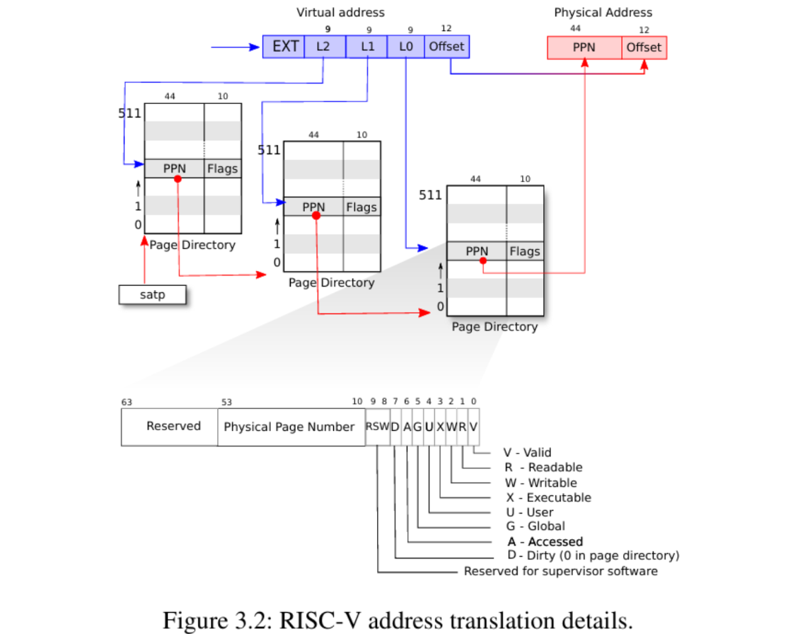
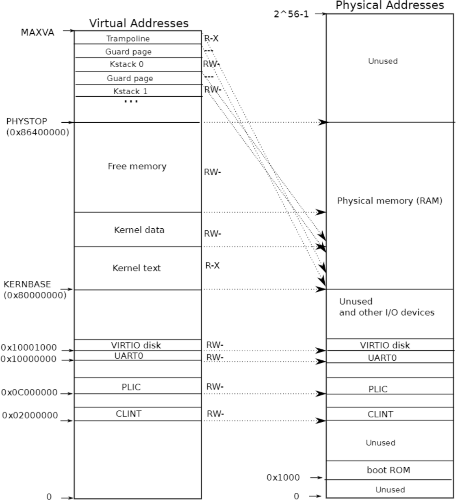

# Mit6.S081-实验3-Page tables

开启实验之前，需要切换本次实验分支：

```c++
git checkout pgtbl
```

## 基础概念

### 页表

页表是操作系统中虚拟内存管理的核心数据结构，用于记录虚拟地址到物理地址的映射关系。

现代的操作系统当中，进程看到的是虚拟地址空间，但是实际物理内存可能远小于这个空间。而且多个进程的虚拟地址可能重叠，但是必须映射到不同的物理地址才能保证隔离。

页表的核心作用就是解决两个问题：

1. 地址翻译：把进程使用的虚拟地址 “翻译” 成物理内存的真实地址。
2. 隔离与共享：让不同进程的虚拟地址映射到不同物理地址（隔离），或按需映射到同一物理地址（共享，如共享库）。

页表的核心原理：分页 + 映射

操作系统会把虚拟地址空间和物理内存都分成固定大小的块，称为 “页”（虚拟页，Virtual Page）和 “页框”（物理页，Physical Frame），两者大小通常相同（如 4KB）。

页表的本质就是一张 “虚拟页号→物理页框号” 的映射表：

- 虚拟地址被拆分为两部分：**虚拟页号（VPN）** + **页内偏移量**（比如 4KB 页大小下，32 位虚拟地址的低 12 位是偏移量，高 20 位是虚拟页号）；
- 页表用 VPN 作为索引，查到对应的物理页框号（PFN）；
- 最终物理地址 = 物理页框号 × 页大小 + 页内偏移量。

实验当中的XV6基于Sv39 RISC-V运行，这意味着它只是用64位虚拟地址的低39位，高25位不使用。而这39位当中，前27位用于索引页表，低12位用于页内偏移。

Sys39的三级页表实现

* 树形结构
  * 三级页表：根页表 -> 中间页表 -> 叶页表
  * 每级页表均为4KB，含有512个PTE

* 查找流程

  * 虚拟地址前27位分三组（9位/级），逐级索引：
    * Level 2索引根页表 → 获得Level 1页表地址。
    * Level 1索引中间页表 → 获得Level 0页表地址。
    * Level 0索引叶页表 → 获得最终PPN。

  - 最终物理地址：PPN（高44位） + 虚拟地址低12位偏移



### TLB

对于一个虚拟内存地址的寻址，需要读三次内存，效率低下，TLB作为**PTE缓存**，存储近期使用的虚拟→物理地址映射，避免重复查表。

**首次访问**：硬件通过三级页表找到物理地址（PPN），同时将映射存入TLB。**后续访问**：直接通过TLB返回物理页框号，拼接上页内偏移量，得到完整的物理地址，**无需页表查询**，性能接近寄存器访问。

当操作系统切换进程（或页表）时，旧进程的TLB映射失效，必须**主动清空TLB**，否则新进程可能错误使用旧缓存（导致地址翻译错误）。

### 内核地址空间



**地址空间布局**：

在Boot ROM阶段，主板通电后首先执行固化在`0x1000`物理地址的Boot ROM代码，完成基础硬件初始化。
**关键跳转**：Boot结束后跳转到`0x80000000`地址，这是操作系统内核的加载位置，内核需提前在此准备好启动数据。

**地址空间布局**：

- **直接映射区域**（虚拟地址 = 物理地址）
  内核将低于`PHYSTOP`的虚拟地址直接映射到相同物理地址，简化早期内存管理。
- **设备访问**
  物理地址低于`0x80000000`时访问I/O设备（如磁盘、网卡），高于则访问DRAM内存。

**内核关键内存区域**：

- **Kernel Stack（内核栈）**
  - **安全设计**：栈底部设有`Guard page`（无效PTE），栈溢出时会触发page fault而非破坏其他数据。
  - **双重映射**：同一栈在虚拟地址空间的高位（带Guard page）和低位（`PHYSTOP`内核数据区）均有映射，实际使用高位以保障安全。
- **Kernel Text（代码段）**
  权限为**R-X**​（只读+可执行），防止代码被篡改（如漏洞攻击）。
- **Kernel Data（数据段）**
  权限为**RW-**​（读写但不可执行），防止数据被当作代码执行（安全防护）。
- **Free Memory（空闲内存）**
  用于动态分配用户进程的资源：
  - 存储进程的页表、代码段（text）和数据段（data）。
  - 资源耗尽时，`fork`或`exec`会返回错误。

**进程页表加载**：

内核为每个进程创建页表后，将根页表地址写入`SATP`寄存器，切换处理器到该进程的虚拟地址空间。

XV6的内存布局是内核自身的虚拟地址空间，而非用户进程的布局，内核虚拟地址空间布局如下：


在XV6中，用户进程的内存布局与内核完全分离，其虚拟地址空间独立于内核，并通过页表机制动态管理。


## 具体实验细节

### Print a page table(easy)

实验任务：需要实现一个打印Sv39模式页表内容的函数，该函数能按照指定格式递归打印三级页表结构。

在Sv39模式下，页表是一个三级树型结构，根页表是这棵树的根节点，它是一个4KB的页，每个页有512个PTE，每个PTE记录了下一级页表的位置。

模拟实际查询页表的过程，需要递归遍历三级页表结构。

在kernel/vm.c中的freewalk()函数中已经实现了递归遍历页表并将其释放，所以只需要模仿其逻辑实现打印即可完成该实验。

1. 在kernel/vm.c中实现traversal_pt函数和vmprint，实行递归遍历页表树。

```c++
// 递归遍历页表树
static void traversal_pt(pagetable_t pagetable, int depth){
    // 遍历页表项
    for(int pte_index = 0; pte_index < 512; pte_index++){
        pte_t current_pte = pagetable[pte_index];
        if(current_pte & PTE_V){
            uint64 pa = PTE2PA(current_pte);
            if(depth == 0){
                printf("..%d: pte %p pa %p\n", pte_index, current_pte, pa);
                traversal_pt((pagetable_t)pa, depth + 1);
            }else if(depth == 1){
                printf(".. ..%d: pte %p pa %p\n", pte_index, current_pte, pa);
                traversal_pt((pagetable_t)pa, depth + 1);
            }else{
                printf(".. .. ..%d: pte %p pa %p\n", pte_index, current_pte, pa);
            }
        }
    }
}

void vmprint(pagetable_t pagetable){
    printf("page table %p\n", pagetable);
    traversal_pt(pagetable, 0);
}
```

在`traversal_pt()` 函数实现的是典型的 深度优先搜索（DFS）的先序遍历，我们先访问当前节点，递归访问所有子节点（进入下一级页表）。

原`freewalk()`函数中同样采用了后序遍历：

```c++
void freewalk(pagetable_t pagetable) {
    for(int i = 0; i < 512; i++) {
        pte_t pte = pagetable[i];
        if(pte & PTE_V) {
            uint64 pa = PTE2PA(pte);
            freewalk((pagetable_t)pa); // 先递归释放子页表
        }
        pagetable[i] = 0; // 后清理当前项
    }
    kfree((void*)pagetable); 
}
```

* freewalk函数是先递归子节点，再处理当前节点
* traversal_pt函数是先处理当前节点，再递归子节点

2. 修改kernel/defs.h中增加vmprint函数的声明。

```c++
// vm.c

// ....
void            vmprint(pagetable_t);
```

3. 在kernel/exec.c中增加对vmprint函数的调用。

```c++
int
exec(char *path, char **argv)
{

    // ........

  if(p->pid == 1){
      vmprint(p->pagetable);
  }
  

  return argc; // this ends up in a0, the first argument to main(argc, argv)

 bad:
  if(pagetable)
    proc_freepagetable(pagetable, sz);
  if(ip){
    iunlockput(ip);
    end_op();
  }
  return -1;
}
```

4. 执行效果

```bash
xv6 kernel is booting

hart 2 starting
hart 1 starting
page table 0x0000000087f6e000
..0: pte 0x0000000021fda801 pa 0x0000000087f6a000
.. ..0: pte 0x0000000021fda401 pa 0x0000000087f69000
.. .. ..0: pte 0x0000000021fdac1f pa 0x0000000087f6b000
.. .. ..1: pte 0x0000000021fda00f pa 0x0000000087f68000
.. .. ..2: pte 0x0000000021fd9c1f pa 0x0000000087f67000
..255: pte 0x0000000021fdb401 pa 0x0000000087f6d000
.. ..511: pte 0x0000000021fdb001 pa 0x0000000087f6c000
.. .. ..510: pte 0x0000000021fdd807 pa 0x0000000087f76000
.. .. ..511: pte 0x0000000020001c0b pa 0x0000000080007000
init: starting sh
```

5. 测试效果

```bash
== Test pte printout == 
$ make qemu-gdb
pte printout: OK (5.0s) 
```


### A kernel page table per process(hard)

在当前的XV6操作系统中，在用户态下的每个用户进程都使用各自的用户态页表。一旦进入内核态就会切换到内核态页表，然而这个内核态页表是全局共享的，所有进程进入内核态之后都会共用一个内核态页表。

可是共享内核态页表的话会有两个主要问题：

1. 进程可能会意外或者恶意地访问其他进程地内核数据。如果一个进程因为BUG或者恶意操作访问了内核中敏感数据，它可能会影响其他进程或者系统的稳定性。
2. 每次创建或者删除进程的时候，都需要小心谨慎更新共享的页表条目，以确保不同进程之间的内存不会冲突或者被错误覆盖，这会增加系统的复杂性，并且在多核系统中，这种全局共享的管理会增加同步开销和冲突的可能性。

解决方案：如果每个进程进入内核态之后，都能有自己独立的内核页表，可以避免很多麻烦，这就是该实验的目的。

1. 在*kernel/proc.h*里面的struct proc加上内核页表的字段。

```c
// 进程控制块
struct proc {
  struct spinlock lock;

  // p->lock must be held when using these:
  enum procstate state;        // Process state
  struct proc *parent;         // Parent process
  void *chan;                  // If non-zero, sleeping on chan
  int killed;                  // If non-zero, have been killed
  int xstate;                  // Exit status to be returned to parent's wait
  int pid;                     // Process ID

  // these are private to the process, so p->lock need not be held.
  uint64 kstack;               // Virtual address of kernel stack
  uint64 sz;                   // Size of process memory (bytes)
  
  pagetable_t kernelPageTable;  // 进程的内核页表
  
  pagetable_t pagetable;       // User page table
  struct trapframe *trapframe; // data page for trampoline.S
  struct context context;      // swtch() here to run process
  struct file *ofile[NOFILE];  // Open files
  struct inode *cwd;           // Current directory
  char name[16];               // Process name (debugging)
};
```

内核进程需要依赖内核页表内一些固定的映射才能正常工作，即这里所写的UART、VIRTIO、CLINT、PLIC、KERNBASE、etext、TRAMPOLINE。原本实现时，kvminit函数原本只为全局内核页表kernel_pagetable添加这些映射，但是此时我们需要为每一个进程都维护一个内核页表，我们就需要为每一个进程的内核页表都添加这些映射。

2. 我们应该将原本的`kvminit`抽象，全局内核页表依然使用这个函数初始化。

```c
// kernel/vm.c

void
kvminit()
{
/*
  kernel_pagetable = (pagetable_t) kalloc();
  memset(kernel_pagetable, 0, PGSIZE);

  // uart registers
  kvmmap(UART0, UART0, PGSIZE, PTE_R | PTE_W);

  // virtio mmio disk interface
  kvmmap(VIRTIO0, VIRTIO0, PGSIZE, PTE_R | PTE_W);

  // CLINT
  kvmmap(CLINT, CLINT, 0x10000, PTE_R | PTE_W);

  // PLIC
  kvmmap(PLIC, PLIC, 0x400000, PTE_R | PTE_W);

  // map kernel text executable and read-only.
  kvmmap(KERNBASE, KERNBASE, (uint64)etext-KERNBASE, PTE_R | PTE_X);

  // map kernel data and the physical RAM we'll make use of.
  kvmmap((uint64)etext, (uint64)etext, PHYSTOP-(uint64)etext, PTE_R | PTE_W);

  // map the trampoline for trap entry/exit to
  // the highest virtual address in the kernel.
  kvmmap(TRAMPOLINE, (uint64)trampoline, PGSIZE, PTE_R | PTE_X);
*/
    kernel_pagetable = kvminit_new_page_table();
}
```

3. 实现kvminit_new_page_table函数，创建一个页表并且初始化映射，返回这个页表。

```c
// kernel/vm.c

pagetable_t kvminit_new_page_table(){
    pagetable_t page_table_ptr = (pagetable_t)kalloc();     // 分配物理页作为页表
    memset(page_table_ptr, 0, PGSIZE);                      // 初始化页表内容
    kvm_map_pagetable(page_table_ptr);                      
    return page_table_ptr;                                  // 返回新页表指针                }
```

此时注意：我们需要让普通进程也要调用kvminit_new_page_table函数来创建属于自己的内核页表，所以我们是需要将这个函数在内核头文件*kernel/defs.h*中声明的。

现在内核中就有两种页表：一种是唯一的内核进程独享的页表，另一种是其他进程各自独享的页表。

在kvminit_new_page_table函数中，我们实现了一个kvm_map_pagetable函数，在kvm_map_pagetable中，实现各个进程维护的页表都添加各种固定的映射。

```c
// kernel/vm.c

void kvm_map_pagetable(pagetable_t page_table_ptr){

  // uart registers
  kvmmap(page_table_ptr, UART0, UART0, PGSIZE, PTE_R | PTE_W);

  // virtio mmio disk interface
  kvmmap(page_table_ptr, VIRTIO0, VIRTIO0, PGSIZE, PTE_R | PTE_W);

  // CLINT
  kvmmap(page_table_ptr, CLINT, CLINT, 0x10000, PTE_R | PTE_W);

  // PLIC
  kvmmap(page_table_ptr, PLIC, PLIC, 0x400000, PTE_R | PTE_W);

  // map kernel text executable and read-only.
  kvmmap(page_table_ptr, KERNBASE, KERNBASE, (uint64)etext-KERNBASE, PTE_R | PTE_X);

  // map kernel data and the physical RAM we'll make use of.
  kvmmap(page_table_ptr, (uint64)etext, (uint64)etext, PHYSTOP-(uint64)etext, PTE_R | PTE_W);

  // map the trampoline for trap entry/exit to
  // the highest virtual address in the kernel.
  kvmmap(page_table_ptr, TRAMPOLINE, (uint64)trampoline, PGSIZE, PTE_R | PTE_X);
}
```

接下来，我们再来看看kvmmap函数发生了什么？

```c++
// kernel/vm.c

// add a mapping to the kernel page table.
// only used when booting.
// does not flush TLB or enable paging.
void
kvmmap(pagetable_t page_table_ptr, uint64 va, uint64 pa, uint64 sz, int perm)
{
  if(mappages(page_table_ptr, va, sz, pa, perm) != 0)
    panic("kvmmap");
}
```

从注释中，我们可以看到这个函数的意思：增加映射到内核页表中，所以我们能够推断出这个函数的作用是**将虚拟地址（VA）映射到物理地址（PA）**。由于此时我们需要将各个固定映射都添加到各个进程中，所以我们需要改造这个kvmmap函数和mappages函数，添加一个变量pagetable_t page_table_ptr，用于初始化每个进程的私有内核页表。

观察到，kvmpa与kvmmap是成对出现的，我们也来看看kvmpa也发生了什么？

```c
// kernel/vm.c

// translate a kernel virtual address to
// a physical address. only needed for
// addresses on the stack.
// assumes va is page aligned.
uint64
kvmpa(pagetable_t page_table_ptr, uint64 va)
{
  uint64 off = va % PGSIZE;
  pte_t *pte;
  uint64 pa;
  
  pte = walk(page_table_ptr, va, 0);
  if(pte == 0)
    panic("kvmpa");
  if((*pte & PTE_V) == 0)
    panic("kvmpa");
  pa = PTE2PA(*pte);
  return pa+off;
}
```

从注释中，我们可以看到这个的作用是将**一个虚拟地址转换成物理地址**，其通过查询页表，找到虚拟地址VA对应的物理地址PA。同理，需要改造这个kvmpa函数和walk函数，添加一个变量pagetable_t page_table_ptr，用于读取每个进程的私有内核页表。

| 函数 | kvmmap                    | kvmpa                |
| ---- | ------------------------- | -------------------- |
| 方向 | 建立映射（VA->PA）        | 解析映射（VA->PA）   |
| 操作 | 写入页表（添加/更新 PTE） | 读取页表（查询 PTE） |
| 用途 | 初始化内存布局            | 动态地址转换         |

注意：这两个函数也是需要在内核头文件*kernel/defs.h*中修改。

经过上述的操作之后，我们就创建进程间相互独立的内核页表了。但是，距离完成任务还是有一定距离的。

我们下面要处理的就是：内核栈。由于XV6支持多线程调度，同一时间可能会有多个进程处于内核态，所以是需要对所有处于内核态的进程创建其独立的内核栈，共给其内核态代码使用的。

在原本XV6中，kernel/proc.c中的procinit函数为每个进程在共享空间中预先分配好内核栈，所以我们需要将这段代码注释了。

```c
// kernel/proc.c

// initialize the proc table at boot time.
void
procinit(void)
{
  struct proc *p;
  
  initlock(&pid_lock, "nextpid");
  for(p = proc; p < &proc[NPROC]; p++) {
      initlock(&p->lock, "proc");

/*

      // Allocate a page for the process's kernel stack.
      // Map it high in memory, followed by an invalid
      // guard page.
      char *pa = kalloc();
      if(pa == 0)
        panic("kalloc");
      uint64 va = KSTACK((int) (p - proc));
      kvmmap(va, (uint64)pa, PGSIZE, PTE_R | PTE_W);
      p->kstack = va;
      
 */
  }
  kvminithart();
}
```

此时我们需要变成创建进程的时候，为进程创建独立的内核页表，然后将属于该进程的内核栈固定到内核页表的固定位置，建立映射。

所以，我们现在需要关注kernel/proc.c中的allocproc函数。

```c
// kernel/pro.c

// Look in the process table for an UNUSED proc.
// If found, initialize state required to run in the kernel,
// and return with p->lock held.
// If there are no free procs, or a memory allocation fails, return 0.
static struct proc*
allocproc(void)
{
  // .......

  // An empty user page table.
  p->pagetable = proc_pagetable(p);
  if(p->pagetable == 0){
    freeproc(p);
    release(&p->lock);
    return 0;
  }

  // 为新进程创建独立的内核页表，并将内核所需要的各种映射添加到新页表中
  p->kernelPageTable = kvminit_new_page_table();

  // 分配一个物理页，作为新进程的内核栈使用
  char* pa = kalloc();
  if(pa == 0){
      panic("kallo");
  }
  // 将内核栈映射到固定的逻辑地址
  uint64 va = KSTACK((int)0);
  kvmmap(p->kernelPageTable, va, (uint64)pa, PGSIZE, PTE_R | PTE_W);
  p->kstack = va;   // 记录内核栈的虚拟地址


  // Set up new context to start executing at forkret,
  // which returns to user space.
  memset(&p->context, 0, sizeof(p->context));
  p->context.ra = (uint64)forkret;
  p->context.sp = p->kstack + PGSIZE;

  return p;
}
```

我们需要在创建了一个空白的用户页表之后，为新进程建立独立的内核页表，并且将内核中所需的各种固定映射添加到内核页表中。

同时申请一个物理页，作为新进程的内核栈使用，将内核栈映射到固定的逻辑地址上，然后在进程控制块中记录内核栈的虚拟地址是多少。

现在进程的内核页表就创建完成了，可是进程进入内核态的时候，还是会先使用全局的内核进程页表，需要在kernel/proc.c中的scheduler函数中进行相关修改。在调度器将CPU交给进程执行之前，加载进程的内核页表到SATP寄存器，切换到该进程对应的内核页表。

具体做法：

1. 当我们创建了一个新的进程，这个进程标记为运行态，绑定进程到当前的CPU核心，加载进程独立的内核页表，清除快表中的缓存，若切换页表后不刷新TLB，CPU可能会继续使用旧的地址映射，导致内存访问错误。
2. 调度执行新的进程。
3. 由于进程可能已释放资源，继续使用其独立页表会导致非法访问，所以需要切换回全局内核页表。

```c
// kernel/proc.c

void
scheduler(void)
{
  struct proc *p;
  struct cpu *c = mycpu();
  
  c->proc = 0;
  for(;;){
    // Avoid deadlock by ensuring that devices can interrupt.
    intr_on();
    
    int found = 0;
    for(p = proc; p < &proc[NPROC]; p++) {
      acquire(&p->lock);
      if(p->state == RUNNABLE) {
        // Switch to chosen process.  It is the process's job
        // to release its lock and then reacquire it
        // before jumping back to us.
        p->state = RUNNING;
        c->proc = p;

        // 切换到进程独立的内核页表
        w_satp(MAKE_SATP(p->kernelPageTable));
        sfence_vma();   // 清除快表缓存，刷新TLB缓存，以确保地址转换表的更改生效

        // 调度：执行进程
        swtch(&c->context, &p->context);

        // 切换回全局内核页表
        kvminithart();

        // Process is done running for now.
        // It should have changed its p->state before coming back.
        c->proc = 0;

        found = 1;
      }
      release(&p->lock);
    }
#if !defined (LAB_FS)
    if(found == 0) {
      intr_on();
      asm volatile("wfi");
    }
#else
    ;
#endif
  }
}
```

现在，每个进程都会在内核态使用自己独立的内核页表了。

当进程结束之后，应该释放进程独享的页表以及内核栈，所以需要在kernel/proc.c中的freeproc函数中，先释放内核栈，再释放进程的内核页表。

```c
// kernel/proc.c

static void
freeproc(struct proc *p)
{
  if(p->trapframe)
    kfree((void*)p->trapframe);
  p->trapframe = 0;
  if(p->pagetable)
    proc_freepagetable(p->pagetable, p->sz);
  p->pagetable = 0;
  p->sz = 0;
  p->pid = 0;
  p->parent = 0;
  p->name[0] = 0;
  p->chan = 0;
  p->killed = 0;
  p->xstate = 0;
  p->state = UNUSED;

  // 释放进程的内核栈
  void* kstack_pa = (void*)kvmpa(p->kernelPageTable, p->kstack);
  kfree(kstack_pa);
  p->kstack = 0;

  // 递归释放进程独享的页表，释放页表本身所占用的空间，但不释放页表指向的物理页
  kvm_free_kernel_page_table(p->kernelPageTable);
  p->kernelPageTable = 0;
  p->state = UNUSED;
}
```

此时需要注意的是，我们是不能使用proc_freepagetable函数来释放资源的，我们先来看proc_freepagetable函数是怎么实现的：

```c
void
proc_freepagetable(pagetable_t pagetable, uint64 sz)
{
  uvmunmap(pagetable, TRAMPOLINE, 1, 0);
  uvmunmap(pagetable, TRAPFRAME, 1, 0);
  uvmfree(pagetable, sz);
}
```

这个函数会将内核进程必要的一些映射也释放了，这会导致其他进程/内核进程的崩溃。所以我们需要在kernel/vm.c中另外写一个kvm_free_kernel_page_table函数通过递归后序遍历，释放内核页表中的所有映射，但是不释放其指向的物理页（固定映射）。写在kernel/vm.c中的原因是：vm.c的核心职责在于页表管理、地址映射与解映射、内存隔离和保护。

```c
void kvm_free_kernel_page_table(pagetable_t pagetable){
    for(int i = 0; i < 512; i++){
        pte_t pte = pagetable[i];
        uint64 child = PTE2PA(pte);
        if((pte & PTE_V) && (pte & (PTE_R | PTE_W | PTE_X)) == 0){
            // 递归释放低一级页表及其页表项
            kvm_free_kernel_page_table((pagetable_t)child);
            pagetable[i] = 0;
        }
    }
    kfree((void*)pagetable);	// 释放当前级别页表所占用的空间
}
```

当然，这个函数也是需要到内核头文件*kernel/defs.h*中声明的。

最后，上面改动了kvmpa函数，这个函数在kernel/virtio_disk.c中也调用了，所以也是需要相应的修改。

```c++
// kernel/virtio_disk.c

#include "proc.h"	// 添加头文件引入

void
virtio_disk_rw(struct buf *b, int write)
{
  // ......

  // buf0 is on a kernel stack, which is not direct mapped,
  // thus the call to kvmpa().
  disk.desc[idx[0]].addr = (uint64) kvmpa(myproc()->kernelPageTable, (uint64) &buf0);
  // ........
}
```

由于我们在kvmpa函数中添加了一个指向页表的指针（PCB），所以我们需要调用myproc函数获取当前CPU核心正在执行的进程的PCB，获取当前进程的独立内核页表。

至此，`A kernel page table per process`这个困难的实验就完成了，接下来我们就可以执行`./grade-lab-pgtbl usertests`来测试这个实验是否能通过，这个实验编译和测试的时间都会相对较长，所以不必惊慌，耐心等待即可！


### Simplify copyin/copyinstr(hard)

该实验的核心任务：在 **每个进程的内核页表中** 复制一份 **用户态地址映射**，使得内核代码能直接通过硬件（MMU/TLB）解引用用户态指针，替代原本低效的软件模拟寻址（`copyin` 函数）。

在原版的`copyin`函数中，它的实现是通过软件模拟页表遍历，然后进入到内核态，内核收到虚拟地址之后，手动逐级查询用户页表，找到物理地址，最后再将数据从物理地址拷贝到内核缓冲区。

注意：用户页表本身既不属于用户态也不属于内核态，而是由内核分配和管理的物理内存数据结构。

为什么一定要将用户页表复制一份给内核页表呢？

原因在于：`satp` 必须指向 **内核页表**（包含内核代码、数据、设备寄存器等关键映射）。若让页表寄存器`satp`强行指向用户页表的话，内核回丢失自己的内存映射（如 `0x80000000` 以上的内核空间），从而导致执行下一条指令时立即崩溃，同时用户页表缺少内核关键映射（如 UART 设备、进程调度栈），系统无法正常运行。

如今优化的方案是：用户页表修改的时候，同步更新内核页表（0~PLIC 区间），内核收到虚拟地址之后，直接通过硬件MMU自动完成地址转换。而MMU的地址转换是依赖于**CPU直接使用内核页表的映射关系**和**TLB快表**。

值得注意的是：当内核修改用户页表时（如分配/释放内存），需 **实时同步更新** 对应进程的内核页表，确保两者在 `0 → PLIC` 地址范围内的映射一致。

1. 在kernel/vm.c实现一个复制页表的函数

```c++
// 实现一个复制页表的函数
int kvm_copy_mappings(pagetable_t source_page_table, pagetable_t dest_page_table, uint64 start_va, uint64 size){
  pte_t* page_table_entry;  // 页表项
  uint64 phys_addr, current_va;
  uint64 flags;
  
  // PGROUNDUP：将地址向上取整到页边界
  for(current_va = PGROUNDUP(start_va); current_va < start_va + size; current_va += PGSIZE){
    // 在源页表中查找当前虚拟地址对应的页表项
    if((page_table_entry = walk(source_page_table, current_va, 0)) == 0){
      panic("kvm_copy_mappings: page table entry no exist.");
    }

    // 检查页表项是否有效
    if((*page_table_entry & PTE_V) == 0){
      panic("kvm_copy_mappings: page not present.");
    }

    // 从页表项中提取物理地址
    phys_addr = PTE2PA(*page_table_entry);

    // 获取页表项标记位，并移除用户权限标志，使得内核模式下可以访问，用户模式下不可访问
    flags = PTE_FLAGS(*page_table_entry) & ~PTE_U;

    // 将物理地址映射到目标页表，使用调整后的标志位
    if(mappages(dest_page_table, current_va, PGSIZE, phys_addr, flags) != 0){
      goto cleanup; // 映射失败时跳转到清理流程
    }
  }
  return 0; // 所有映射复制成功

cleanup:
  // 解除目标页表中已建立的映射
  // 从对齐后的起始地址开始，回滚已建立的页表项
  uvmunmap(dest_page_table, PGROUNDUP(start_va), (current_va - PGROUNDUP(start_va))/PGSIZE, 0);
  return -1;
}
```

* 从起始地址开始，按页大小递增处理（使用PGROUNDUP确保地址按页对齐）。
* 通过`walk`函数，在源页表中查找当前虚拟地址对应的页表项。
* 从页表项中提取物理地址（一个 **页表项（PTE）** 仅描述 **一个虚拟页（4KB）到物理页的映射**，而非整个页表）。
* 移除用户权限标志（PTE_U），确保内核专属访问。
* 将物理地址映射到目标页表。
* 如果映射失败，跳转到清理流程：`uvmunmap`函数中实现了解除目标页表中已建立的映射 + 回滚已建立的页表项。

此处需要注意，页表项（PTE）是64位，实际RISC-V Sv39仅支持56位物理地址（PPN（物理页号）44位 + 标志位12位）。

2. 此时还需在kernel/vm.c中，实现一个缩减内存的函数，用于内核页表和用户页表内存映射的同步，通常在用户进程释放内存的时候被调用。

```c++
// 实现一个内存缩减的函数，用于内核页表和用户页表内存映射的同步
uint64 kvm_dealloc(pagetable_t page_table, uint64 old_size, uint64 new_size){
  if(new_size >= old_size){
    return old_size;
  }
  if(PGROUNDUP(new_size) < PGROUNDUP(old_size)){
    int num_pages = (PGROUNDUP(old_size) - PGROUNDUP(new_size)) / PGSIZE;
    uvmunmap(page_table, PGROUNDUP(new_size), num_pages, 0);
  }
  return new_size;
}
```

该函数的目标在于：当用户进程的内存大小从 `old_size` 缩减到 `new_size` 时，**解除页表中超出 `new_size` 部分的映射**，确保内核和用户页表的一致性。

3. 在XV6操作系统当中，用于映射程序内存的地址范围是：`[0, PLIC)`，这里需要解释一下，映射程序内存的地址指的是通过页表将程序使用的虚拟地址与物理内存的实际位置建立关联。

首先需要在kernel/memlayout.h中添加PLIC的宏定义

```c++
#define PLIC 0x0c000000L
```

可是把进程的程序内存映射到其内核页表的这个范围内，需要先确认这个范围内没有和其他映射冲突。

通过查看XV6手册中，可以发现这个范围内的CLINT（核心本地中断器）的映射和刚刚说的这个范围产生了映射冲突。


不过，从XV6的手册中可知，CLINT映射只有在内核启动的时候才需要使用，在内核态的用户进程并不需要使用这个映射。

因此需要修改上一个实验当中的`kvm_map_pagetable`函数，去掉其CLINT映射。

```c++
void kvm_map_pagetable(pagetable_t page_table_ptr){

  // uart registers
  kvmmap(page_table_ptr, UART0, UART0, PGSIZE, PTE_R | PTE_W);

  // virtio mmio disk interface
  kvmmap(page_table_ptr, VIRTIO0, VIRTIO0, PGSIZE, PTE_R | PTE_W);

  // CLINT
  // CLINT 仅在内核启动的时候需要使用到，而用户进程在内核态中的操作并不会使用到该映射，并且该映射会与要 map 的程序内存冲突
  // kvmmap(page_table_ptr, CLINT, CLINT, 0x10000, PTE_R | PTE_W);

  // PLIC
  kvmmap(page_table_ptr, PLIC, PLIC, 0x400000, PTE_R | PTE_W);

  // map kernel text executable and read-only.
  kvmmap(page_table_ptr, KERNBASE, KERNBASE, (uint64)etext-KERNBASE, PTE_R | PTE_X);

  // map kernel data and the physical RAM we'll make use of.
  kvmmap(page_table_ptr, (uint64)etext, (uint64)etext, PHYSTOP-(uint64)etext, PTE_R | PTE_W);

  // map the trampoline for trap entry/exit to
  // the highest virtual address in the kernel.
  kvmmap(page_table_ptr, TRAMPOLINE, (uint64)trampoline, PGSIZE, PTE_R | PTE_X);
}
```

这样内核态的用户进程中的内核页表中就不会有程序内存映射和CLINT映射冲突的问题了。但是这个映射在内核启动的时候是必须添加的，所以可以在全局内核页表初始化中加上这个映射。

```c++
void
kvminit()
{
/*
  kernel_pagetable = (pagetable_t) kalloc();
  memset(kernel_pagetable, 0, PGSIZE);

  // uart registers
  kvmmap(UART0, UART0, PGSIZE, PTE_R | PTE_W);

  // virtio mmio disk interface
  kvmmap(VIRTIO0, VIRTIO0, PGSIZE, PTE_R | PTE_W);

  // CLINT
  kvmmap(CLINT, CLINT, 0x10000, PTE_R | PTE_W);

  // PLIC
  kvmmap(PLIC, PLIC, 0x400000, PTE_R | PTE_W);

  // map kernel text executable and read-only.
  kvmmap(KERNBASE, KERNBASE, (uint64)etext-KERNBASE, PTE_R | PTE_X);

  // map kernel data and the physical RAM we'll make use of.
  kvmmap((uint64)etext, (uint64)etext, PHYSTOP-(uint64)etext, PTE_R | PTE_W);

  // map the trampoline for trap entry/exit to
  // the highest virtual address in the kernel.
  kvmmap(TRAMPOLINE, (uint64)trampoline, PGSIZE, PTE_R | PTE_X);
*/
    kernel_pagetable = kvminit_new_page_table();

    // 进程的内核页表不存在程序内存映射和CLINT映射冲突问题
    // CLINT的映射在全局内核页表中永久存在，但是用户程序是无法访问的
    kvmmap(kernel_pagetable, CLINT, CLINT, 0x10000, PTE_R | PTE_W);
}
```

4. 在kernel/exec.c中的`exec()`中加入检查，防止程序内存超过PLIC

```c++
int
exec(char *path, char **argv)
{
  // .......

  // Load program into memory.
  for(i=0, off=elf.phoff; i<elf.phnum; i++, off+=sizeof(ph)){
    if(readi(ip, 0, (uint64)&ph, off, sizeof(ph)) != sizeof(ph))
      goto bad;
    if(ph.type != ELF_PROG_LOAD)
      continue;
    if(ph.memsz < ph.filesz)
      goto bad;
    if(ph.vaddr + ph.memsz < ph.vaddr)
      goto bad;
    uint64 sz1;
    if((sz1 = uvmalloc(pagetable, sz, ph.vaddr + ph.memsz)) == 0)
      goto bad;

    if(sz1 >= PLIC){  // 防止程序内存大小超过 PLIC
      goto bad;
    }

	// ......
}
```

5. 接下来需要将涉及到用户页表的修改，都需要将其相应的修改同步到进程的内核页表中，包括`fork()`、`exec()`、`growproc()`、`userinit()`

* `fork()`：使用``uvmcopy``函数将父进程用户页表中 `[0, p->sz)` 范围内的所有有效映射到子进程用户页表（`np->pagetable`）；使用`kvm_copy_mappings`函数将子进程用户页表（`np->pagetable`）中 `[0, p->sz)` 的映射同步到子进程的内核页表（`np->kernelPageTable`），确保内核能直接访问子进程的用户内存。

```c++
// kernel/proc.c

int
fork(void)
{
  // ......

  // Copy user memory from parent to child.
  // 加入调用 kvm_copy_mappings，将新进程用户页表映射拷贝一份到新进程内核页表中
  if(uvmcopy(p->pagetable, np->pagetable, p->sz) < 0 || kvm_copy_mappings(np->pagetable, np->kernelPageTable, 0, p->sz) < 0){
    freeproc(np);
    release(&np->lock);
    return -1;
  }
  np->sz = p->sz;

 	// .....
}
```

* `exec()`：该函数的功能是替换当前进程的内存映像，加载新程序，并重新初始化进程的地址空间，所以我们需要清除内核页表中对程序内存的旧映射，重新建立映射。

```c++
// kernel/exec.c

int
exec(char *path, char **argv)
{
  // .....

  // 清除内核页表中对程序内存的旧映射，重新建立映射
  uvmunmap(p->kernelPageTable, 0, PGROUNDUP(oldsz) / PGSIZE, 0);
  kvm_copy_mappings(pagetable, p->kernelPageTable, 0, sz);
  
  // Commit to the user image.
  oldpagetable = p->pagetable;
  p->pagetable = pagetable;
  p->sz = sz;
  p->trapframe->epc = elf.entry;  // initial program counter = main
  p->trapframe->sp = sp; // initial stack pointer
  proc_freepagetable(oldpagetable, oldsz);

  // .......
}
```

* `growproc()`：该函数的作用是调整进程用户内存的大小，所以对于内存扩展和内存收缩需要做出相应的修改
  * 内存扩展时
    * 通过`newsz = uvmalloc(p->pagetable, sz, sz + n)`，在用户页表中分配新的物理页，建立 `[sz, sz+n)` 的虚拟地址映射。
    * 通过`if(kvm_copy_mappings(p->pagetable, p->kernelPageTable, sz, n) != 0)`，将用户页表中新增的 `[sz, sz+n)` 映射同步到内核页表（移除 `PTE_U` 标志）。
    * 通过`sz = newsz`，更新内存大小。
  * 内存收缩时
    * 通过`uvmdealloc(p->pagetable, sz, sz + n)`，释放用户页表中 `[sz+n, sz)` 范围的映射（可能延迟释放物理页）。
    * 通过`sz = kvm_dealloc(p->kernelPageTable, sz, sz + n)`解除内核页表对 `[sz+n, sz)` 的映射（不释放物理页）。

```c++
// kernel/proc.c

int
growproc(int n)
{
  uint sz;
  struct proc *p = myproc();

  sz = p->sz;
  if(n > 0){
    uint64 newsz;
    if((newsz = uvmalloc(p->pagetable, sz, sz + n)) == 0) {
      return -1;
    }

    // 内核页表中的映射同步扩大
    if(kvm_copy_mappings(p->pagetable, p->kernelPageTable, sz, n) != 0){
      uvmalloc(p->pagetable, newsz, sz);
      return -1;
    }
    sz = newsz;
  } else if(n < 0){
    uvmdealloc(p->pagetable, sz, sz + n);
    // 内核页表中的映射同步缩小
    sz = kvm_dealloc(p->kernelPageTable, sz, sz + n);
  }
  p->sz = sz;
  return 0;
}
```

* `userinit()`： XV6 操作系统初始化第一个用户进程（init 进程）的关键函数，需要同步用户页表和内核页表，确保内核能访问该进程的内存。

```c++
// kernel/proc.c

void
userinit(void)
{
  struct proc *p;

  p = allocproc();
  initproc = p;
  
  // allocate one user page and copy init's instructions
  // and data into it.
  uvminit(p->pagetable, initcode, sizeof(initcode));
  p->sz = PGSIZE;

  // 同步程序内存映射到进程内核页表中
  kvm_copy_mappings(p->pagetable, p->kernelPageTable, 0, p->sz);

  // ....
}
```

6. 按照实验要求，在kernel/vm.c中替换`copyin`和`copyinstr`

```c++
int
copyin(pagetable_t pagetable, char *dst, uint64 srcva, uint64 len)
{
  // uint64 n, va0, pa0;

  // while(len > 0){
  //   va0 = PGROUNDDOWN(srcva);
  //   pa0 = walkaddr(pagetable, va0);
  //   if(pa0 == 0)
  //     return -1;
  //   n = PGSIZE - (srcva - va0);
  //   if(n > len)
  //     n = len;
  //   memmove(dst, (void *)(pa0 + (srcva - va0)), n);

  //   len -= n;
  //   dst += n;
  //   srcva = va0 + PGSIZE;
  // }
  // return 0;
  return copyin_new(pagetable, dst, srcva, len);
}
```

```c++
int
copyinstr(pagetable_t pagetable, char *dst, uint64 srcva, uint64 max)
{
  // uint64 n, va0, pa0;
  // int got_null = 0;

  // while(got_null == 0 && max > 0){
  //   va0 = PGROUNDDOWN(srcva);
  //   pa0 = walkaddr(pagetable, va0);
  //   if(pa0 == 0)
  //     return -1;
  //   n = PGSIZE - (srcva - va0);
  //   if(n > max)
  //     n = max;

  //   char *p = (char *) (pa0 + (srcva - va0));
  //   while(n > 0){
  //     if(*p == '\0'){
  //       *dst = '\0';
  //       got_null = 1;
  //       break;
  //     } else {
  //       *dst = *p;
  //     }
  //     --n;
  //     --max;
  //     p++;
  //     dst++;
  //   }

  //   srcva = va0 + PGSIZE;
  // }
  // if(got_null){
  //   return 0;
  // } else {
  //   return -1;
  // }
  return copyinstr_new(pagetable, dst, srcva, max);
}
```

`copyin_new`和`copyinstr`已经在`kernel/vmcopyin.c`中实现。

7. 在最后我们需要将新添加的函数、修改了参数的函数去kernel/defs.h中做出相应修改

```c++
uint64          kvmpa(pagetable_t, uint64);
void            kvmmap(pagetable_t, uint64, uint64, uint64, int);

void            vmprint(pagetable_t);
pagetable_t     kvminit_new_page_table();
void            kvm_free_kernel_page_table(pagetable_t);
int             kvm_copy_mappings(pagetable_t, pagetable_t, uint64, uint64);
uint64          kvm_dealloc(pagetable_t, uint64, uint64);

int             copyin_new(pagetable_t, char *, uint64, uint64);
int             copyinstr_new(pagetable_t, char *, uint64, uint64);
```

至此，整个系列最难的一个Lab就圆满完成了！
