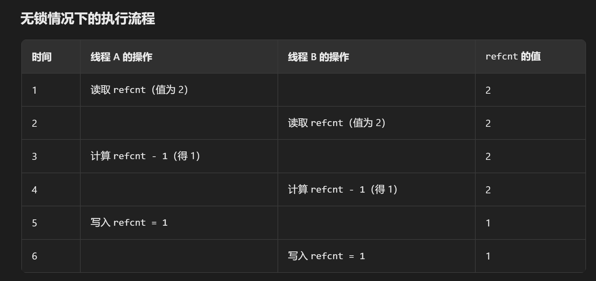

# 实验6-Copy-on-Write Fork for xv6

开启实验之前，需要切换本次实验分支：

```c++
git checkout cow
```

## 基础概念

在传统操作系统中（如原始XV6），`fork()` 函数会**完整复制父进程的地址空间**给子进程。子进程复制整个地址空间会十分消耗性能。

改进的思路：引用COW fork。

1. **共享物理页**：
   - 子进程创建时，**仅复制父进程的页表**，用户内存的物理页（PTE）**直接指向父进程的物理页**，而非立即复制。
   - 父进程和子进程的所有用户态 PTE 均被标记为**不可写**（只读）。
2. **按需复制**：
   - 当任一进程尝试写入共享的 COW 页时，CPU 会触发**缺页异常**。
   - 内核的缺页处理程序检测到该异常后：
     - **分配新物理页**，将原始页内容复制到新页。
     - **修改故障进程的 PTE**，指向新页并标记为可写。
   - 处理完成后，进程可正常写入自己的副本，父进程和其他子进程仍共享原始页。
3. **物理页释放的挑战**：
   - 同一物理页可能被多个进程共享，需通过**引用计数机制**跟踪引用数。
   - 仅当最后一个引用该物理页的进程退出或修改时，才真正释放内存。


## 实验实现细节

### Implement copy-on write（hard）

1. 在kernel/riscv.h中，给页表添加新的标志位，用于表示这个页是否是写时复制页（即共享页）。

```c++
#define PTE_V (1L << 0) // valid
#define PTE_R (1L << 1)
#define PTE_W (1L << 2)
#define PTE_X (1L << 3)
#define PTE_U (1L << 4) // 1 -> user can access
#define PTE_COW (1L << 8)   // 8-9是明确保留给操作系统自定义使用
```

2. 通过阅读kernel/proc.c，可以发现，父进程在使用fork函数创建子进程的时候会调用uvmcopy函数

```c++
int
fork(void)
{
  int i, pid;
  struct proc *np;
  struct proc *p = myproc();

  // Allocate process.
  if((np = allocproc()) == 0){
    return -1;
  }

  // Copy user memory from parent to child.
  if(uvmcopy(p->pagetable, np->pagetable, p->sz) < 0){
    freeproc(np);
    release(&np->lock);
    return -1;
  }
  np->sz = p->sz;

  np->parent = p;

  // copy saved user registers.
  *(np->trapframe) = *(p->trapframe);

  // Cause fork to return 0 in the child.
  np->trapframe->a0 = 0;

  // increment reference counts on open file descriptors.
  for(i = 0; i < NOFILE; i++)
    if(p->ofile[i])
      np->ofile[i] = filedup(p->ofile[i]);
  np->cwd = idup(p->cwd);

  safestrcpy(np->name, p->name, sizeof(p->name));

  pid = np->pid;

  np->state = RUNNABLE;

  release(&np->lock);

  return pid;
}
```

3. 在kernel/vm.c文件中的uvmcopy函数可以发现，uvmcopy会把父进程映射的物理页全都复制一份给子进程。所以，此处需要完成写时复制的相关操作。

   1. 以页面大小为步长，遍历整个地址空间。

      1. 清除父进程中所有PTE中的PTE_W位，并且设置PTE_COW位，如果该页本身就是不可写（只读），则不需要添加这个标志位。

      2. 获取父进程页表项中的所有标志位。

      3. 通过mapages映射到子进程，这个函数只是单纯让子进程的页表也指向父进程相同的物理页，而不是直接复制物理页的内容。如下代码，才是直接复制物理页的内容：
         ```c
         if(mappages(new, i, PGSIZE, (uint64)pa, flags) != 0){
           goto err;
         }
         ```

      4. 增加物理页面的引用计数。

   2. 当发生mapages映射子进程失败的时候，需要跳转到错误处理，取消已经映射的子进程页表项。

```c++
int
uvmcopy(pagetable_t old, pagetable_t new, uint64 sz)
{
  pte_t *pte;
  uint64 pa, i;
  uint flags;
  // char *mem;

  for(i = 0; i < sz; i += PGSIZE){
    if((pte = walk(old, i, 0)) == 0)
      panic("uvmcopy: pte should exist");
    if((*pte & PTE_V) == 0)
      panic("uvmcopy: page not present");
    pa = PTE2PA(*pte);

    // 清除父进程中所有PTE的PTE_W位，并且设置PTE_COW位
    if(*pte & PTE_W){
      *pte = (*pte & ~PTE_W) | PTE_COW;
    }

    flags = PTE_FLAGS(*pte);  // 获取当前父进程pte的标志位

    // 将父进程映射的物理页也同样映射到子进程中
    if(mappages(new, i, PGSIZE, (uint64)pa, flags) != 0){
      goto err;
    }

    krefpage((void *)pa);   // 映射的物理页的引用数 + 1

    // if((mem = kalloc()) == 0)
    //   goto err;
    // memmove(mem, (char*)pa, PGSIZE);
    // if(mappages(new, i, PGSIZE, (uint64)mem, flags) != 0){
    //   kfree(mem);
    //   goto err;
    // }
  }
  return 0;

 err:
  uvmunmap(new, 0, i / PGSIZE, 1);
  return -1;
}
```

此处的`krefpage`函数是使物理页引用计数 + 1，为了避免内存泄漏，多个进程映射同一个物理页的时候，记录这个物理页的引用数，调用`kfree`释放物理页的时候，只需对该引用计数 - 1，当引用计数为0的时候，才需要释放物理页，这个函数将会在后续实现。

此时，使用fork函数的时候，就不会将父进程的物理页直接复制给子进程，父进程和子进程都映射到同一片物理内存，且所有的页都是不可写的状态。当某一进程尝试执行写操作的时候，就会出现页面错误，被usertrap函数捕获，所以接下来需要到kernel/trap.c中，修改usertrap函数，实现在修改页的时候，才创建和映射新的物理页。

```c++
void
usertrap(void)
{
	// ......
  } else if((which_dev = devintr()) != 0){
    // ok
  }else if((r_scause() == 13 || r_scause() == 15) && uvmcheckcowpage(r_stval())){
    // 发生页面错误，并且检测出错误是写时复制机制导致的页面不可写，则执行写时复制
    if(uvmcowcopy(r_stval()) == -1){
      p->killed = 1;
    }
  } else {
    printf("usertrap(): unexpected scause %p pid=%d\n", r_scause(), p->pid);
    printf("            sepc=%p stval=%p\n", r_sepc(), r_stval());
    p->killed = 1;
  }

	// .......
}
```

调用r_scause判断是否是页面错误，同时还需要实现一个uvmcheckcowpage函数判断是否是COW机制导致的页面错误，当符合这些条件的时候，再实现一个uvmcowcopy函数执行写时复制操作。

在kernel/vm.c中，实现uvmcheckcowpage函数：

```c++
// 检查虚拟地址所在页是否是COW页
int uvmcheckcowpage(uint64 va){
  pte_t* pte;
  struct proc* p = myproc();
  return va < p->sz
      && ((pte = walk(p->pagetable, va, 0)) != 0)   // 地址在进程内存范围内
      && (*pte & PTE_V)   // 页表项有效
      && (*pte & PTE_COW);  // 属于COW页
}
```

在kernel/vm.c中，实现uvmcowcopy函数：

```c++
// 实现写时复制
// 复制一个新的物理页，创建新的映射
int uvmcowcopy(uint64 va){
  pte_t* pte;
  struct proc* p = myproc();

  // 获取虚拟地址页表项
  if((pte = walk(p->pagetable, va, 0)) == 0){
    panic("uvmcowcopy: walk");
  }

  uint64 pa = PTE2PA(*pte); // 获取映射的物理地址
  uint64 new = (uint64)kcopy_n_deref((void*)pa);   // 获取新分配的物理页（如果原本的物理页引用数为1，则获取到的还是原本的物理页）
  if(new == 0){   // 内存不足的情况
    return -1;
  }

  // 修改新的映射，恢复写权限，清除COW标志
  uint64 flags = (PTE_FLAGS(*pte) | PTE_W) & ~PTE_COW;
  uvmunmap(p->pagetable, PGROUNDDOWN(va), 1, 0);
  if(mappages(p->pagetable, va, 1, new, flags) == -1){
    panic("uvmcowcopy:mappages");
  }
  return 0;
}
```

1. 获取虚拟地址页表项->获取映射的物理地址。
2. 检查物理页pa的引用计数：
   1. 如果引用计数 > 1的时候，说明还有其他进程共享该页，就需要分配新页并复制数据。
   2. 如果引用计数 = 1的时候，说明仅仅只有当前进程在使用该页，则直接返回原物理页pa，无需复制。
3. 获取新分配的物理页。
4. 修改新的映射，恢复写权限，清除COW标志。
5. 清除旧的映射，建立新的映射。

为什么要修改新的映射的时候，恢复写权限，清除COW标志？

只有满足页表项被标记为PTE_COW + 进程尝试写入该页的时候才会触发COW，而被标记为PTE_COW在正常情况下，只会因为父进程fork出新的子进程的时候，才会被标记为PTE_COW。而恢复写权限的意义在于，当进程独占该页的时候，单纯只是执行写操作的时候，是无需陷入写时复制的。

此处，调用了一个我们自己实现的`kcopy_n_deref`函数，这个函数的作用是：当有进程通过COW复制新的物理页时，把原本的物理页的引用数 - 1，返回新创建的物理页地址。如果原本的物理页引用计数就是1的话，那直接使用原本的物理页，这个函数将会在后续实现。

在kernel/vm.c中，还存在一个copyout函数，这个函数的作用是内核用于将数据从内核空间复制到用户空间的函数，其通过软件遍历页表，不依赖MMU，因此不会触发缺页异常，用户空间的共享页会被标记为PTE_COW且PTE_W=0，写入这些页的时候，硬件MMU会触发缺页异常，内核通过usertrap处理COW，但是copyout函数绕过了硬件MMU，直接通过软件写页表，而这将会导致数据不一致，因此，copyout函数必须在写入前，主动检查COW页。

譬如：父进程 P `fork` 子进程 C，共享页 `A`（`PTE_COW=1`，`PTE_W=0`），内核通过 `copyout` 直接向 `A` 写入数据（未触发缺页异常）。可是，**页表状态**：父子进程的页表仍认为 `A` 是共享的（`PTE_COW=1`）。而**实际内存**：`A` 已被内核修改，但未分配新页，**父子进程数据意外共享**！

至此，已经实现了COW的大致逻辑，但是距离实验结束还有一段距离，接下来需要对页的生命周期进行管理，确保页没有任何进程使用的时候才释放。

原本XV6中，一个物理页只会在一个进程中有映射，kalloc用来分配物理页，kfree用来回收物理页。在COW机制中，一个物理页会有多个进程中有映射，所以要在最后一个映射释放的时候，才真正释放回收该物理页。

因此需要实现的逻辑：

* kalloc：分配物理页，将其引用计数置为1
* krefpage：创建物理页的一个新映射的时候，引用计数 + 1
* kcopy_n_deref：将原物理页的数据复制到一个新物理页上，新物理页的引用计数为1，返回得到的新物理页，同时将原物理页的引用计数 - 1
* kfree：释放物理页的一个映射，引用计数 - 1，如果引用计数变为0，则需要释放回收物理页

在kernel/kalloc.c中，定义一些相关的宏

```c++
#define PA2PGREF_ID(p) (((p)-KERNBASE)/PGSIZE)  // 由物理地址获取物理页id
#define PGREF_MAX_ENTRIES PA2PGREF_ID(PHYSTOP)  // 物理页数上限

int pageref[PGREF_MAX_ENTRIES]; // 记录每一个物理页的引用数
struct spinlock pgreflock;      // 用于pageref数组的锁

#define PA2PGREF(p) pageref[PA2PGREF_ID((uint64)(p))]   // 获取地址对应物理页引用数
```

在kernel/kalloc.c中，初始化锁

```c++
void
kinit()
{
  initlock(&kmem.lock, "kmem");

  initlock(&pgreflock, "pgref");  // 初始化锁

  freerange(end, (void*)PHYSTOP);
}
```

在kernel/kalloc.c中，修改kalloc函数

```c++
void *
kalloc(void)
{
  struct run *r;

  acquire(&kmem.lock);
  r = kmem.freelist;
  if(r)
    kmem.freelist = r->next;
  release(&kmem.lock);

  if(r){
    memset((char*)r, 5, PGSIZE); // fill with junk
    PA2PGREF(r) = 1;    // 将新分配的物理页的引用数设置为 1，此时此刻只有一个进程持有这个物理页，所以无需加锁
  }
  return (void*)r;
}
```

在kernel/kalloc.c中，修改kfree函数

```c++
void
kfree(void *pa)
{
  struct run *r;

  if(((uint64)pa % PGSIZE) != 0 || (char*)pa < end || (uint64)pa >= PHYSTOP)
    panic("kfree");

  // 当页面的引用数<=0的时候释放页面
  acquire(&pgreflock);
  if(--PA2PGREF(pa) <= 0){
    // Fill with junk to catch dangling refs.
    memset(pa, 1, PGSIZE);
    r = (struct run*)pa;
    acquire(&kmem.lock);
    r->next = kmem.freelist;
    kmem.freelist = r;
    release(&kmem.lock);
  }
  release(&pgreflock);
}
```

在kernel/kalloc.c中，实现krefpage函数

```c++
// 实现物理页引用数+1
void krefpage(void *pa){
  acquire(&pgreflock);
  PA2PGREF(pa)++;
  release(&pgreflock);
}
```

在kernel/kalloc.c中，实现kcopy_n_deref函数

```c++
// 实现将原物理页的数据复制到一个新物理页上（引用数为1），返回得到的新物理页，并将原物理页的引用数-1
// 如果引用数=1，则无需操作直接返回该物理页
void* kcopy_n_deref(void *pa){
  acquire(&pgreflock);
  
  // 当前物理页的引用数为1，则无需分配新的物理页
  if(PA2PGREF(pa) <= 1){
    release(&pgreflock);
    return pa;
  }

  // 分配新的物理页，并把旧页中的数据复制到新页中
  uint64 newpa = (uint64)kalloc();
  if(newpa == 0){   // 内存不足
    release(&pgreflock);
    return 0;
  }
  memmove((void*)newpa, (void*)pa, PGSIZE);

  // 旧页引用数-1
  PA2PGREF(pa)--;

  release(&pgreflock);
  return (void*)newpa;
}
```

值得注意的是，这个函数是需要加上自旋锁的，自旋锁的作用在于保护物理页的引用计数的原子性，因为不加锁的话，可能会导致两个线程同时`PA2PGREF(pa)--;`



**至此，这个实验到这里就圆满完成了！**