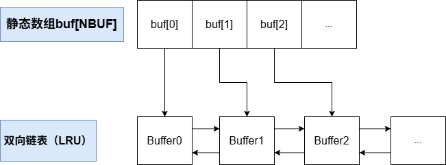

# Mit6.S081-实验9-File system

开启实验之前，需要切换本次实验分支：

```c++
git checkout fs
```

## 基础概念

### 文件系统

文件系统是操作系统用于持久化存储、组织和管理数据的一套机制，它通过逻辑抽象（如文件、目录、权限等）和底层数据结构（如索引表、块分配表等），将物理存储设备（如磁盘、SSD）的原始空间转换为用户和程序可以理解、可以操作的层次化结构，同时提供数据安全、共享和高效访问的能力。

简单来说，文件系统的本质正式通过逻辑抽象和数据结构，在物理上无序的磁盘空间构建出一个虚拟的有序层。这种"有序"是文件系统通过巧妙的映射和规则创造出来的假象，而磁盘底层实际上可能仍是分散甚至"混乱"的。

文件系统的核心使命是高效组织与存储数据，并充当用户和应用程序之间的共享数据平台。为了实现这个核心使命，需要解决一下的关键难题：

1. 数据结构管理
   1. 在磁盘上构建目录树和文件名体系
   2. 精准记录每个文件对应的存储块位置
   3. 动态维护磁盘空闲区域映射表
2. 崩溃恢复
   1. 确保系统在意外断电或故障后仍能保持一致性
3. 多进程协调
   1. 当多个进程同时操作文件系统时，需要通过同步机制维护数据不变性
4. 性能优化
   1. 由于磁盘I/O比内存访问慢多个数量级，必须通过内存缓存机制加速高频访问块的读写

XV6文件系统的实现分为7层：

| 文件系统七层模型 |
| :--------------: |
|    文件描述符    |
|      路径名      |
|       目录       |
|     索引结点     |
|       日志       |
|  缓冲区高速缓存  |
|       磁盘       |

文件描述符层：对用户进程提供统一的接口（如`open()`、`read()`）,抽象文件、管道、设备等资源，程序员无序关心路径解析、inode或磁盘块分配。

路径名层：解析层级路径，通过递归查找目录项逐级定位最终文件。

目录层：目录是特殊类型的inode，其内哦让那个为目录项列表（每个条目包含文件名和对应的索引号（i-number））。

索引结点层：每个文件对应一个inode，包含元数据（权限、大小、创建时间等）和指向数据块的指针，通过唯一的索引号（i-number）标识文件。

日志层：将多个块的更新打包为事务，保证原子性，崩溃恢复时，根据日志回滚未完成的操作。

缓冲区高速缓存层：缓存频繁访问的磁盘块，通过锁机制确保块级互斥。

磁盘层：读取和写入virtio虚拟硬盘的物理块。

> XV6操作系统的文件系统磁盘布局结构示意图**（存在于磁盘中）**


* boot引导块：存储系统启动代码。
* super超级块：存储文件系统的元数据（文件系统总大小、inode区域其实块号，数据块位图位置，日志区域大小）。
* inodes区：存储所有文件的inode（索引节点），每个inode包含文件类型、权限、所有者、大小、数据块指针。
* bitmap数据块位图：用位图标记数据块是否被占用。
* data数据块区：存储实际文件内容或目录项。

### 缓冲区高速缓存层（Buffer Cache）

阅读`kernle/bio.c`的代码

#### Buffer Cache

缓冲区Buffer Cache是内存中的数据结构，其核心作用是临时存储磁盘块的副本，作为磁盘与内核线程之间的高速缓存层。

```c++
struct buf {
  int valid;   // 数据是否有效（1=有效，0=需从磁盘读取）
  int disk;    // 是否需写回磁盘（1=脏数据，0=干净）
  uint dev;    // 设备号
  uint blockno;// 磁盘块号（扇区号）
  struct buf *prev; // 双向链表前驱指针
  struct buf *next; // 双向链表后继指针
  uchar data[BSIZE]; // 实际数据区（BSIZE=磁盘块大小，如512字节）
  int refcnt;  // 引用计数（0=可重用）
};

struct {
  struct buf buf[NBUF];      // 静态数组，预分配所有缓冲区
  struct buf head;           // 双向链表的哑节点（dummy head）
} bcache;
```

可以发现Buffer Cache有两个任务：

1. 同步对磁盘块的访问，以确保磁盘块在内存中只有一个副本，并且一次只对一个内核线程使用该副本。
2. 缓存常用块。

Buffer Cache层的相关函数

* `bread`功能
  * 获取一个内存中缓冲区，，其中包含指定磁盘块的副本
  * 返回的缓冲区处于锁定状态，确保当前线程独占访问
* `bwrite`功能
  * 将内存中修改后的缓冲区内容写回磁盘对应块
* `brelse`功能
  * 释放缓冲区及其关联的锁
  * 其他线程可以重新通过`bread`获取该缓冲区

并发控制：睡眠锁

* 每个缓冲区绑定一个睡眠锁，保证同一时间仅一个线程可以操作缓冲区（即同一磁盘块）。
* 工作流程：
  * `bread` 返回已锁定的缓冲区 → 线程修改数据 → `bwrite` 提交 → `brelse` 释放锁。

缓存管理策略：LRU（最近最少使用）

- 缓存容量固定：
  - 缓冲区数量有限，若请求的磁盘块未缓存，需**回收旧缓冲区**。
- 回收规则：
  - 优先释放**最近最少使用（LRU）的缓冲区**。

Buffer Cache以双链表形式组织，由`binit`函数在系统启动时候初始化。其中有一个静态数组buf，静态数组buf的大小为NBUF，静态数组的作用在于：当系统启动的时候，通过静态数组一次性分配所有缓存块所需要的内存，同时静态数组的大小（NBUF）决定了系统最多能缓存的磁盘块数量，防止缓存无限膨胀导致内存耗尽（与线程池、内存池的思想高度一致）。

前面的静态数组的核心作用是"预先固定分配所有缓存块的内存"，而静态数组的缺陷在于移动元素会导致极大的性能开销，而使用链表的话则能够让后续的LRU淘汰策略的操作性能大大提高。

图示如下：



那后续我们在进行LRU策略的时候，我们就只需要操作双向链表即可。

Buffer缓存区中有两个与之关联的状态字段：

* `valid`表示缓冲区是否包含块的副本
* `disk`表示缓冲区内容是否回写给磁盘

`bread`调用`bget`根据设备号和扇区号查找Buffer缓存区。

若缓存区数据有效（即缓存区中含有块的副本），则`bget`获取缓冲区的睡眠锁，然后`bget`返回锁定的缓冲区。

若缓存区数据无效（即缓存区中不含有块的副本），找一个当前未被使用的缓冲区（refcnt=0），然后覆盖其原有的设备号和扇区号，替换为目标值，再调用`virtio_disk_rw`从磁盘读取数据到缓冲区中。而怎么读取数据到缓冲区中呢？原因就是设置valid=0，通过vaild=0之后，明确告知`bread`必须从磁盘重新加载数据到缓存块中。

一旦`bread`读取了磁盘并将缓冲区返回给其调用者的时候，调用者就可以独占使用缓冲区，并可以读取或写入数据字节。如果调用者确实修改了缓冲区，则必须再释放缓冲区之前调用`bwrite`将更改的数据写入磁盘中。`bwrite`调用`virtio_disk_rw`与磁盘硬件对话。

当调用方使用完缓冲区之后，它必须调用`brelse`来释放缓冲区。`brelse`释放睡眠锁并将缓冲区移动到链表的前面。移动缓冲区会使双向链表按照缓冲区的使用频率排序：

- **链表头部（第一个节点）**：**最近最多使用（MRU）**的缓冲区。
- **链表尾部（最后一个节点）**：**最近最少使用（LRU）**的缓冲区（优先被重用）。

`bget`中有两个循环：

1. 第一个循环：正向扫描（查找现有缓冲区）

   1. **扫描方向**：从链表头部（`bcache.head`）开始，沿 `next` 指针向后遍历。

   2. **目的**：查找是否已有缓存目标磁盘块的缓冲区（匹配 `dev` 和 `blockno`）。

   3. 优化点：

      - **局部性优先**：由于链表头部是**最近使用的缓冲区**（MRU），大概率是活跃数据，优先检查它们可加速命中。

      - **减少扫描次数**：若数据近期被访问过，可能在链表前端，无需遍历整个链表。

2. 第二个循环：反向扫描（选择重用缓冲区）

   1. **扫描方向**：从链表尾部（`prev` 指针）开始，向前遍历。
   2. **目的**：当缓存未命中时，选择一个**最近最少使用（LRU）的缓冲区**（`refcnt=0`）进行重用。
   3. 优化点：
      - **公平性**：链表尾部是最久未使用的缓冲区，优先重用对缓存命中率影响最小。
      - **效率**：反向扫描直接定位到最可能被替换的缓冲区，避免无谓遍历。

#### inode（索引节点）

##### inode概念

inode 是一个 **64 字节的元数据结构**，用于描述文件或目录的属性和存储位置。

- `type`：标识是文件还是目录。
- `nlink`：硬链接计数（多少文件名指向此 inode）。
- `size`：文件数据的字节数。
- 直接块（Direct Blocks）：
  - inode 包含 **12 个直接块编号**，每个编号指向一个 **1KB 的磁盘块**。
  - **小文件存储**：文件 ≤12KB 时，仅需直接块即可存下全部数据。
- **间接块（Indirect Block）**：
  - 1 个间接块编号指向一个 **二级索引块**，该块存储 **256 个数据块编号**（每个编号占 4 字节，1KB/4B=256）。
  - **大文件扩展**：间接块支持额外存储 256KB 数据。

因此，我们可以计算出XV6的最大文件尺寸：12 × 1KB + 256 × 1KB = 268KB。

**inode有两种含义：**

* **磁盘上的 inode**：
  持久化存储的元数据，记录文件的实际信息。
* **内存中的 inode**：
  内核运行时加载的副本，包含磁盘 inode 数据 + 额外运行时信息（如锁、引用计数等）。

##### **内存inode中的锁机制**

>  inode的相关字段

**`icache.lock`（全局缓存锁）**

- **保护对象**：全局 inode 缓存（`icache`）。
- 功能：
  - 确保每个磁盘 inode 在内存缓存中 **仅有一个副本**（避免重复加载浪费内存）。
  - 保护 inode 的 `ref` 字段的原子性（准确统计内存中指向该 inode 的指针数量）。

**`inode.sleeplock`（单个 inode 睡眠锁）**

- **保护对象**：单个 inode 的元数据和数据块。
- 功能：
  - 确保对 inode 的 **元数据（如 `type`、`size`）** 和 **数据块内容** 的修改是线程安全的。
  - 允许进程在等待锁时睡眠（避免忙等待），适合长时操作（如磁盘I/O）。

**`ref` 字段（内存引用计数）**

- 作用：
  - 记录内存中 **指向该 inode 的 C 指针数量**（通过 `iget` 增加，`iput` 减少）。
  - 当ref = 0时：
    - 表示无代码引用该 inode，**内存缓存可释放**（但磁盘上的 inode 仍存在）。
    - 若同时 `nlink = 0`，则彻底释放磁盘 inode 及其数据块。

**`nlink` 字段（磁盘硬链接计数）**

- 作用：
  - 记录 **有多少个目录项（硬链接）指向该磁盘 inode**。
  - 当nlink = 0且ref = 0时：
    - 表示无目录引用且无内存引用，**彻底删除磁盘 inode 和数据块**。

> inode的相关函数：

**`iget(dev, inum)`：**

- 返回指定设备号 `dev` 和 inode 号 `inum` 对应的 **内存 inode 指针**。
- **不持有锁**：允许多进程并发获取同一 inode 的指针（提高效率）。
- **增加 `ref`**：确保 inode 在调用 `iput` 前不会被释放。

- 注意：
  - 实际访问 inode 数据前需调用 `ilock` 加锁（睡眠锁）。

**`iput(ip)`：**

- 减少 inode 的 `ref` 计数。
- 若ref = 0：
  - 检查 `nlink`，若也为 0 则释放磁盘 inode 和数据块。
  - 从内存缓存中移除该 inode。

**`ilock(ip)`：**

- 获取 inode 的睡眠锁（`ip->lock`），确保独占访问。
- 若 inode 数据未加载（`valid = 0`），从磁盘读取元数据和块索引。

##### **内存inode的并发安全控制**

- **核心功能**：确保多进程对 inode 的并发访问安全。
- 缓存保留规则：
  - 当存在 C 指针引用 inode 时（即 **`ref > 0`**），该 inode 会常驻内存缓存，**不会被释放**。
- 数据同步策略：
  - 采用 **直写（write-through）** 策略，所有修改通过 **`iupdate()`** 函数**立即写入磁盘**，保证缓存与磁盘强一致。

##### **磁盘inode分配流程**

**`ialloc`函数：**

* 核心作用：初始化新的磁盘 inode，用于创建 **文件/目录/设备节点**。
* 分配步骤
  * 遍历 inode 列表：
    - 寻找 **`type == 0`** 的空闲 inode（`type=0` 表示未分配）。
  * 初始化 inode：
    - 设置 `type` 字段为指定类型（如文件、目录等）。
  * 加载到内存：
    - 通过 **`iget`** 函数将磁盘 inode 读入内存缓存。
* 使用 **`bread`** 读取磁盘块时，**磁盘块指针 `bp` 处于上锁状态（睡眠锁）**，确保整个分配过程是原子的（无竞态条件）。

**`iput`函数：**

* 核心功能

  - 将内存 inode 的 `ref`（引用计数）减 1。

  - 若ref减至 0：
    - 表示 **无任何指针引用该 inode**，其缓存槽位可被其他 inode 重用。
    - 若同时满足 `nlink == 0`（无硬链接指向磁盘 inode），则 **彻底释放** 该 inode 及其占用的数据块。

* 当 `ref == 1` 且 `nlink == 0` 时，**仅当前线程持有该 inode 的引用**，其他线程无法通过 `iget` 获取其指针。在`iput`函数中，先获取 `icache.lock`（全局缓存锁），再获取 `inode.lock`（睡眠锁），**避免死锁**。

* 若 `ialloc` 尝试分配的新 inode 恰好是 `iput` 正在释放的 inode：

  - `ialloc` 会等待 `inode.lock`，**确保读写操作不会冲突**。
  - 这种竞争是 **良性的**，因 `ialloc` 会等待 `iput` 完成释放后再继续。

* `iput` 可能触发磁盘写入（如释放 inode 或数据块），因此：

  - 所有文件系统调用（包括只读操作）必须在事务中执行，以保证：
    - 崩溃恢复时的文件系统一致性。
    - 多步操作的原子性（如删除文件需同步更新目录、inode、数据块）。

当文件的硬链接计数（`nlink`）降为 0，但某些进程仍持有该 inode 的引用（如通过 `open()` 打开文件并读写），此时 ​**不能立即释放 inode 及其占用的磁盘资源**。

若系统在最后一个进程关闭文件前崩溃，磁盘上将残留：

- 标记为 **“已分配”** 的 inode。

- **无任何目录项** 指向该 inode（因 `nlink=0`）。

此类“孤儿”inode 会持续占用磁盘空间，最终导致 ​**存储资源耗尽**。

现代文件系统的解决方案：

* 崩溃恢复后全盘扫描
  - 流程：系统重启时，扫描所有 inode，释放满足以下条件的 inode：
    - 标记为 **“已分配”**（`type ≠ 0`）。
    - **无目录项引用**（`nlink=0`）。

* 动态跟踪列表（超级块维护）
  - 流程：
    - 运行时将 `nlink=0` 但 `ref>0` 的 inode 记录到 **超级块（superblock）的专用列表** 中。
    - 重启时仅检查列表中的 inode：
      - 若 `ref=0` → 释放资源。
      - 若 `ref>0` → 保留（仍有进程引用）。

可惜，XV6并未实现上述机制，XV6 作为教学系统，未处理此类崩溃一致性问题，导致：

- “孤儿”inode **永久占用磁盘空间**。
- 需手动清理或扩展文件系统逻辑。

## 具体实验细节

### Large files（moderate）

在kernel/fs.h中，可以看到inode的结构如下：

```c++
// kernel/fs.h
#define NDIRECT 12
#define NINDIRECT (BSIZE / sizeof(uint))
#define MAXFILE (NDIRECT + NINDIRECT)

// On-disk inode structure
struct dinode {
    short type;    // 文件类型
    short major;    // 主设备号(仅用于T_DEVICE类型)
    short minor;    // 次设备号(仅用于T_DEVICE类型)
    short nlink;    // 文件系统中的链接数
    uint size;    // 文件大小(字节)
    uint addrs[NDIRECT+1];   // 数据块地址
};
```

addrs字段用于记录数据所在的磁盘块号，采用了两次索引结构：

1. 直接块
   1. 前12个磁盘块号直接记录在inode中（`addrs[0]~addrs[11]`）
   2. 每个磁盘块大小为1024B（BSIZE）
   3. 可以直接访问文件前12KB（12 × 1024B）
2. 一级间接块
   1. 对于大于12个块的文件，使用`addrs[12]`指向一个一级索引表
   2. 索引表大小为1024B，可以存储256个块号（1024B/4B）
   3. 索引块本身占用一个磁盘块

因此，最大块数：12（直接） + 256（间接）= 268个块，最大文件大小：268 × 1024B。

根据题目提示，该实验需要修改inode的结构，修改成11个直接块，1个一级间接块，1个二级间接块。

可以在kernel/fs.h先修改inode结构体，注意这个是磁盘inode的结构体：

```c++
#define NDIRECT 11                                               // 直接块数量
#define NINDIRECT (BSIZE / sizeof(uint))                         // 一级间接块数量
#define MAXFILE (NDIRECT + NINDIRECT + NINDIRECT * NINDIRECT)    // 二级间接块数量

// On-disk inode structure
struct dinode {
  short type;           // File type
  short major;          // Major device number (T_DEVICE only)
  short minor;          // Minor device number (T_DEVICE only)
  short nlink;          // Number of links to inode in file system
  uint size;            // Size of file (bytes)
  uint addrs[NDIRECT+2];   // 0~10：直接索引    11：一级间接索引    12：二级间接索引
};
```

然后在kernel/file.h修改内存inode的副本结构体：

```c++
// in-memory copy of an inode
struct inode {
  uint dev;           // Device number
  uint inum;          // Inode number
  int ref;            // Reference count
  struct sleeplock lock; // protects everything below here
  int valid;          // inode has been read from disk?

  short type;         // copy of disk inode
  short major;
  short minor;
  short nlink;
  uint size;
  uint addrs[NDIRECT + 2];	// 修改
};
```

直接块腾出一个位置给二级间接块。

为了形成11个直接索引+1个一级间接索引+1个二级间接索引的格局，首先需要改的第一个函数是`bmap`，这个函数是将inode中的第`bn`个逻辑块号和物理块号建立映射（逻辑块号指的是文件内的偏移量，物理块号是由磁盘 inode 的 `addrs` 数组定义，内存 inode 缓存了该数组），当进程通过`read()`、`write()`等系统调用访问文件的某一个部分的时候，文件系统就需要使用到`bmap`函数，原本的`bmap`如下：

```c++
// kernel/fs.c
static uint
bmap(struct inode *ip, uint bn)
{
    uint addr, *a;
    struct buf *bp;

    // 如果bn小于直接块数量，则按直接映射处理
    if(bn < NDIRECT){
        if((addr = ip->addrs[bn]) == 0)    // 如果对应的物理块号为0，表示还没分配，则分配
            ip->addrs[bn] = addr = balloc(ip->dev);
        return addr;
    }

    // 到这里已经是间接块了，减去直接块的数量得到间接块的逻辑块号
    bn -= NDIRECT;

    if(bn < NINDIRECT){
        // 如果间接块还没分配，分配一个
        if((addr = ip->addrs[NDIRECT]) == 0)    // 0~NDIRECT-1是直接块，NDIRECT是间接块
            ip->addrs[NDIRECT] = addr = balloc(ip->dev); // 此时这个块可以映射256个块

        // 获取刚分配的缓存块，检查bn对应的块，如果为0则没有分配，建立映射
        bp = bread(ip->dev, addr);
        a = (uint*)bp->data;
        if((addr = a[bn]) == 0){
            a[bn] = addr = balloc(ip->dev);
            log_write(bp);
        }
        brelse(bp);    // 建立映射结束，释放掉缓存块（可以通过ip->dev和bn找到这个块了）
        return addr;
    }
    panic("bmap: out of range");
}
```

**直接块处理**:

- 如果请求的逻辑块号 `bn` 小于 `NDIRECT` (12)，则检查对应的直接块是否已分配
- 如果未分配(`addr == 0`)，调用 `balloc` 分配一个新的物理块
- 返回直接块的物理地址

**间接块处理**:

- 对于逻辑块号 ≥12 的请求，先减去12得到间接块内的偏移量
- 检查间接块指针(`ip->addrs[NDIRECT]`)是否已分配，未分配则分配一个
- 读取间接块内容到缓冲区
- 检查间接块中对应位置是否已分配物理块，未分配则分配并记录
- 释放缓冲区并返回物理块地址

**错误处理**:

- 如果请求的逻辑块号超出最大范围(≥268)，触发 panic

理解了上述代码的思路之后，就可以改造成11个直接索引+1个一级间接索引+1个二级间接索引的形式了。

```c++
// kernel/fs.c

// 将文件内的逻辑块号转换为磁盘上的物理块号
static uint
bmap(struct inode *ip, uint bn)   // ip：文件inode指针，bn：文件的逻辑块号
{
  uint addr, *a;    // addr：物理块号，a：间接块指针
  struct buf *bp;   // bp：磁盘缓冲区块指针

  // 如果bn小于直接块数量（12），则直接处理
  if(bn < NDIRECT){
    // 检查该逻辑块是否已经分配物理块
    if((addr = ip->addrs[bn]) == 0){
      // 分配新的物理块，并且记录到inode的直接块表中
      ip->addrs[bn] = addr = balloc(ip->dev);
    }
    return addr;    // 返回物理块号
  }

  // 处理间接块：减去直接块数量，得到一级间接块
  bn -= NDIRECT;

  // 检查bn是否在一级间接块支持的范围内（256）
  if(bn < NINDIRECT){
    // 检查间接块本身是否已经分配
    if((addr = ip->addrs[NDIRECT]) == 0){
      // 分配一个物理块作为间接块，并且记录到inode中，这个块可以映射256个块
      ip->addrs[NDIRECT] = addr = balloc(ip->dev);
    }

    // 读取一级间接块内容到缓冲区
    bp = bread(ip->dev, addr);
    // 将缓冲区数据转换为uint数组，每个元素对应一个子块的物理块号
    a = (uint*)bp->data;

    // 检查一级间接块中第bn项是否已经分配物理块
    if((addr = a[bn]) == 0){
      // 分配新的物理块，并写入间接块
      a[bn] = addr = balloc(ip->dev);
      log_write(bp);  // 将修改写入磁盘日志
    }
    brelse(bp);   // 释放缓冲区
    return addr;  // 返回最终物理块号
  }

  // 处理间接块：得到二级间接块
  bn -= NINDIRECT;

  if(bn < NINDIRECT * NINDIRECT){   // 检查bn是否在二级间接块支持范围内
    if((addr = ip->addrs[NDIRECT + 1]) == 0){   // 检查二级间接块是否已分配
      ip->addrs[NDIRECT + 1] = addr = balloc(ip->dev);  // 未分配则分配新块
    }
    bp = bread(ip->dev, addr);    // 读取二级间接块到缓冲区
    a = (uint*)bp->data;          // 转化为物理块号数组（256个一级间接块）
    if((addr = a[bn/NINDIRECT]) == 0){  // 计算一级间接块索引
      a[bn / NINDIRECT] = addr = balloc(ip->dev); // 未分配则分配新块给一级间接块
      log_write(bp);  // 记录二级间接块的修改
    }
    brelse(bp);   // 释放二级间接块缓冲区

    bn %= NINDIRECT;  // 计算一级间接块内的偏移
    bp = bread(ip->dev, addr);  // 读取一级间接块
    a = (uint*)bp->data;  // 转化物理块号数组（256个数据块）
    if((addr = a[bn]) == 0){    // 检查数据块是否已分配
      a[bn] = addr = balloc(ip->dev); // 分配数据块
      log_write(bp);    // 记录一级间接块的修改
    }
    brelse(bp);   // 释放一级间接块缓冲区
    return addr;  // 返回数据块物理号
  }
  panic("bmap: out of range");
}
```

**直接块处理**：

- 若 `bn` 是直接块（`bn < 12`），直接返回 `ip->addrs[bn]`。
- 若该位置未分配（`addr == 0`），调用 `balloc()` 分配新物理块并记录到 inode 中。

**一级间接块处理**：

* 若一级间接块未分配，先分配一个物理块作为间接块。
* 读取间接块内容到缓冲区，从中查找第 `bn` 项对应的物理块号。
* 若该项未分配，分配新块并更新间接块内容（需写磁盘日志）。

**二级间接块处理**：

* 若二级间接块未分配，先分配一个物理块作为二级间接块。
* 从二级间接块中查找一级间接块的索引。
* 若一级间接块未分配，分配并更新二级间接块。
* 从一级间接块中查找数据块的索引，分配数据块并更新。

经过上述操作之后，就完成了文件内的逻辑块号转换为磁盘上的物理块号，可是当我们需要释放inode所映射的数据块的操作还未完成，`itrunc()` 函数的作用是 释放一个 inode 关联的所有数据块，并将文件大小截断为 0。当用户删除文件（如 `rm a.txt`）或目录时，内核调用 `unlink()`，最终通过 `ip->truncate()` 触发 `itrunc()`。

在kernel/fs.c中，修改`itrunc`函数

```c++
void
itrunc(struct inode *ip)
{
  int i, j;
  struct buf *bp;
  uint *a;

  // 释放直接块的映射
  for(i = 0; i < NDIRECT; i++){
    if(ip->addrs[i]){
      bfree(ip->dev, ip->addrs[i]);
      ip->addrs[i] = 0;
    }
  }

  // 释放一级间接块的映射
  if(ip->addrs[NDIRECT]){
    bp = bread(ip->dev, ip->addrs[NDIRECT]);
    a = (uint*)bp->data;
    for(j = 0; j < NINDIRECT; j++){
      if(a[j]){
        bfree(ip->dev, a[j]);
        a[j] = 0;
        log_write(bp);
      }
    }
    brelse(bp);
    bfree(ip->dev, ip->addrs[NDIRECT]);
    ip->addrs[NDIRECT] = 0;
  }

  // 释放二级间接块的映射
  if(ip->addrs[NDIRECT + 1]){
    bp = bread(ip->dev, ip->addrs[NDIRECT + 1]); // 读取二级间接块到内存缓冲区
    a = (uint*)bp->data;  // 将缓冲区数据转换为uint数组
    // 遍历二级间接块的所有条目
    for(int i = 0; i < NINDIRECT; i++){
      if(a[i]){   // 如果一级间接块存在
        struct buf* bp2 = bread(ip->dev, a[i]); // 读取一级间接块到缓冲区
        uint* a2 = (uint*)bp2->data;  // 转换为uint数组
        
        // 遍历一级间接块的所有条目
        for(int j = 0; j < NINDIRECT; ++j){
          if(a2[j]){
            bfree(ip->dev, a2[j]);  // 释放数据块
            a2[j] = 0;
            log_write(bp2);
          }
        }
        brelse(bp2);  // 释放一级间接块缓冲区
        bfree(ip->dev, a[i]); // 释放一级间接块本身
        a[i] = 0;
        log_write(bp);
      }
    }
    // 释放二级间接块资源
    brelse(bp); // 释放二级间接块缓冲区
    bfree(ip->dev, ip->addrs[NDIRECT + 1]); // 释放二级间接块
    ip->addrs[NDIRECT + 1] = 0;
  }

  ip->size = 0; // 文件大小归零
  iupdate(ip);  // 将inode的修改写回磁盘
}
```

至此，这个实验就已经完成了！

### Symbolic links（moderate）

该实验需要实现的是软链接机制，实现一个软链接系统调用函数`symlink`。

添加新的文件类型`T_SYMLINK`，表示文件为软链接文件：

```c++
// kernel/stat.h

#define T_DIR     1   // Directory
#define T_FILE    2   // File
#define T_DEVICE  3   // Device
#define T_SYMLINK 4   // 软链接
```

添加新的文件标志为`O_NOFOLLOW`，该标志可用于`open`系统调用：

```c++
// kernel/fcntl.h

#define O_RDONLY  0x000
#define O_WRONLY  0x001
#define O_RDWR    0x002
#define O_CREATE  0x200
#define O_TRUNC   0x400
#define O_NOFOLLOW  0x800
```

`sys_symlink` 系统调用的实现步骤：

1. **创建加锁的 inode**
   调用 `create` 函数创建一个指向**源文件**的 inode，此时 inode 处于**加锁状态**​（防止并发操作冲突）。
2. **写入链接目标路径**
   通过 `writei` 函数将**目标文件的地址**​（即软链接指向的实际路径）写入该 inode 的数据块中。
   （注：软链接的本质是将目标路径作为文本存储在自己的数据块中）
3. **释放 inode 资源**
   调用 `iunlockput` 函数完成以下操作：
   - **解锁 inode**：释放其锁。
   - **引用计数减 1**：若引用归零，则回收 inode。
   - **标记操作结束**：软链接创建完成，释放相关资源。

```c++
// kernel/sysfile.c

// 软链接
uint64 sys_symlink(void){
  struct inode* ip; // ip：指向软链接文件的索引节点的指针
  char target[MAXPATH], path[MAXPATH];  // 存储目标路径和软链接的路径

  // 从用户态寄存器读取参数
  if(argstr(0, target, MAXPATH) < 0 || argstr(1, path, MAXPATH) < 0){
    return -1;
  }

  begin_op(); // 开启文件系统事务（保证原子操作）

  // 创建软链接文件
  ip = create(path, T_SYMLINK, 0, 0);
  if(ip == 0){
    end_op();
    return -1;
  }

  // 将目标路径字符串写入软链接文件的数据块
  if(writei(ip, 0, (uint64)target, 0, strlen(target)) < 0){
    end_op();
    return -1;
  }

  iunlockput(ip); // 释放inode的锁 + 减少inode的引用数量
  end_op();   // 完成持久化
  return 0;
}
```

- 调用`create`函数在文件系统中新建一个文件，并明确指定其类型为`T_SYMLINK`（符号链接类型）。
- 系统为该文件分配一个新的inode，此时inode处于**初始空状态**（无数据块关联）。

- 在父目录中创建新的目录项（dentry），将用户指定的路径名`path`与新建的inode关联。
- 此后通过路径`path`可定位到该符号链接的inode。

- 调用`writei`函数，将符号链接指向的**目标路径字符串**（`target`）写入inode的数据块中。
- 写入后，该文件内容即为目标路径（例如写入`/etc/passwd`，则链接指向此文件）。

在kernel/sysfile.c中，修改`sys_open`函数， `sys_open` 系统调用中实现**递归解析逻辑**，确保能正确处理符号链接（软链接）。

- **循环调用 `namei`**：
  通过该函数逐层解析路径，获取每个组件的 inode。
  *示例*：若路径为 `/a/b`，先解析 `a` 的 inode，再解析 `b`。
- 软链接判断每次获取 inode 后，检查其类型是否为T_SYMLINK：
  - **是软链接**：读取链接指向的目标路径，替换当前路径，继续调用 `namei` 解析。
  - **非软链接**：终止循环，返回当前 inode。
- **深度限制**：
  设置最大递归次数（如 32 次），防止恶意构造的循环链接导致内核栈溢出。

```c++
// kernel/sysfile.c

uint64
sys_open(void)
{
	// ......

  begin_op();

  if(omode & O_CREATE){
    ip = create(path, T_FILE, 0, 0);
    if(ip == 0){
      end_op();
      return -1;
    }
  } else {

    int symlink_depth = 0;
    while(1){
      if((ip = namei(path)) == 0){  // 解析路径获取inode
        end_op();
        return -1;
      }
      ilock(ip);  // 加锁
      if(ip->type == T_SYMLINK && (omode & O_NOFOLLOW) == 0){   // 如果当前指向的仍为软链接，则继续循环
        if(++symlink_depth > 10){
          iunlockput(ip);
          end_op();
          return -1;
        }
        if(readi(ip, 0, (uint64)path, 0, MAXPATH) < 0){
          iunlockput(ip);
          end_op();
          return -1;
        }
        iunlockput(ip);
      }else{
        break;
      }
    }

    if(ip->type == T_DIR && omode != O_RDONLY){
      iunlockput(ip);
      end_op();
      return -1;
    }
  }

  if(ip->type == T_DEVICE && (ip->major < 0 || ip->major >= NDEV)){
    iunlockput(ip);
    end_op();
    return -1;
  }

 	// ......
}
```

至此，这个实验就结束了！
